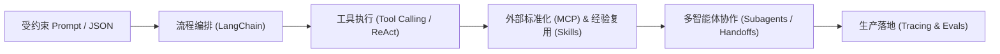

# AI Agent Engineering Notes (智能体工程实战学习与复盘笔记)

> 本仓库专注于记录掘金专栏小册 [《AI Agents 开发实践》](https://juejin.cn/book/7626976407423303731)（作者：言萧凡）的学习过程、核心概念拆解、架构推演与个人复盘思考。配套的全栈工程实践代码，请前往独立仓库 [agentic-fullstack-monorepo](https://github.com/heiye-vn/agentic-fullstack-monorepo)。

---

## 🏗️ 双仓库协作架构

| 仓库                                    | 定位               | 内容形态                                                     | 关联地址                                                                                      |
| :-------------------------------------- | :----------------- | :----------------------------------------------------------- | :-------------------------------------------------------------------------------------------- |
| **ai-agent-engineering-notes** (本仓库) | **知识沉淀与复盘** | 教程原文备份、各章节精读笔记 (`note.md`)、架构思考           | [heiye-vn/ai-agent-engineering-notes](https://github.com/heiye-vn/ai-agent-engineering-notes) |
| **agentic-fullstack-monorepo**          | **产品工程落地**   | 全栈工程底座到智能体落地（Next.js + NestJS + Docker + LangChain），按章节分支演进 | [heiye-vn/agentic-fullstack-monorepo](https://github.com/heiye-vn/agentic-fullstack-monorepo) |

### 📌 工程分支映射指南

| 分支名 | 对应章节 | 说明 |
| :----- | :------- | :--- |
| [`chapter-01-monorepo-setup`](https://github.com/heiye-vn/agentic-fullstack-monorepo/tree/chapter-01-monorepo-setup) | Chapter 02 底座篇 | pnpm workspace + Turbo monorepo 基础底座搭建与前后端联通 |
| [`chapter-02-user-system`](https://github.com/heiye-vn/agentic-fullstack-monorepo/tree/chapter-02-user-system) | Chapter 02 AI 接管篇 | PostgreSQL 基础设施扩展与 user-system 用户系统 |
| [`chapter-03-first-chain`](https://github.com/heiye-vn/agentic-fullstack-monorepo/tree/chapter-03-first-chain) | Chapter 03 | LangChain 工具绑定、自动工具循环与第一条服务端能力链路 |
| [`main`](https://github.com/heiye-vn/agentic-fullstack-monorepo/tree/main) | - | 最新主线整合分支 |

---

## 📑 教程与笔记

- **[`tutorial/`](./tutorial/)**：教程章节目录，收录各章节的教程原文备份。
- **`chapter01/` ~ `chapter0N/`**：各章节的个人精读与复盘笔记（`note.md`）。

---

## 🧩 智能体技术演进全景图

根据小册梳理的智能体能力演进阶梯：

- **Prompt / Schema**：解决模型输出的可控性与结构化确定性
- **LangChain / 编排**：解决流程串联与上下文链路传递
- **Tool Calling**：解决模型突破信息边界、执行具体操作的能力
- **MCP & Skills**：解决外部系统接入的标准化与团队沉淀经验的复用
- **Multi-Agent**：解决复杂长链路任务下的上下文膨胀与职责分工
- **Tracing / Evals**：解决上线必须面对的链路可追溯、质量评估与成本控制

---

## 🔗 参考与致谢

- **参考课程**：掘金专栏小册 [《AI Agents 开发实践》](https://juejin.cn/book/7626976407423303731) （作者：言萧凡_CookieBoty）
- **配套工程**：[heiye-vn/agentic-fullstack-monorepo](https://github.com/heiye-vn/agentic-fullstack-monorepo) (基于当前学习演进落地的全栈 Monorepo 实践项目，多分支对应各阶段交付)
