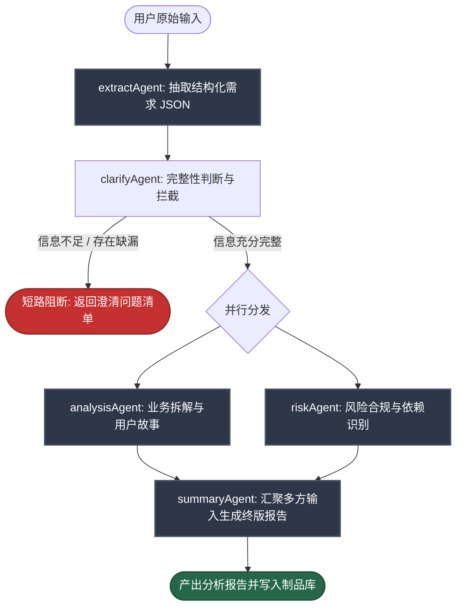
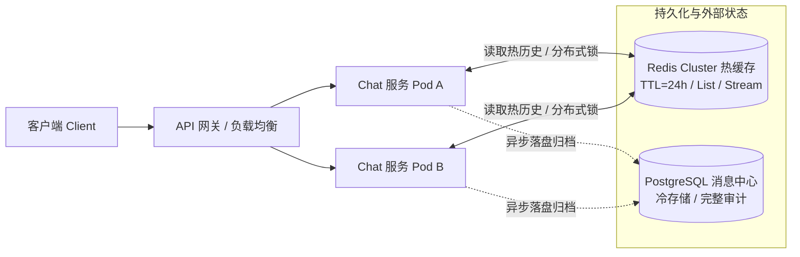

# 第四章核心总结与企业级架构扩展：记忆、受控工具与多 Agent 协同

> **来源**：《AI Agents 开发实践》第四章（`feat/agent-memory-tools` 分支）  
> **核心命题**：从**单轮无状态闭环**迈向**具备持久记忆、受控外部交互与多角色分工的复杂业务处理单元**  
> **贯穿场景**：需求分析助手（以需求单 `REQ-2026-001` 为例），实现从单次问答到“抽取 → 澄清 → 分析 → 风控 → 汇总”的自动化工程化落地

---

## 一、第四章核心知识体系全景

第三章解决了“单次模型调用如何组装成可测试、可维护、有确定性输出的链路”，但其本质仍是**单次请求驱动的无状态模式**。第四章的核心目标是打破单轮局限，通过**记忆（Memory）、消息裁剪（Trimming）、业务工具（Tools）、向量化底座（Embeddings & Vector Store）、多 Agent 编排（Multi-Agent）**，将系统升级为具备长程一致性与外部执行力的企业级应用。

```
                    ┌─────────────────────────────────────────────────────────────┐
                    │               Unified Entrypoint: analyze()                 │
                    └──────────────────────────────┬──────────────────────────────┘
                                                   │
                ┌──────────────────────────────────┴──────────────────────────────────┐
                ▼                                                                     ▼
   【上下文工程与持久记忆】                                                【Multi-Agent 协同流】
┌───────────────────────────────┐                             ┌───────────────────────────────────────┐
│  Session 隔离与状态管理       │                             │  Fixed Workflow 编排                  │
│  RunnableWithMessageHistory   │                             │  extractAgent  (结构化提取)           │
│  trimMessages (Token 预算裁剪)│                             │  clarifyAgent  (完整性拦截与反问)      │
│  appendMessage (结论写回历史) │                             │  analysisAgent ║ riskAgent (并行分析) │
└───────────────────────────────┘                             │  summaryAgent  (多维报告汇聚)         │
                │                                             └───────────────────┬───────────────────┘
                ▼                                                                 ▼
   【语义底座与外部交互】                                                    【业务工具闭环】
┌───────────────────────────────┐                             ┌───────────────────────────────────────┐
│  Embeddings (语义向量表征)    │                             │  query_requirement (查询业务事实)     │
│  Vector Store (相似度语义检索)│                             │  read_file          (读取规范标准)     │
│  本地轻量模型 (离线与低成本)  │                             │  write_file / safePath (受控落盘)     │
└───────────────────────────────┘                             └───────────────────────────────────────┘
```

---

### 1. 业务痛点：多轮需求沟通为什么会“失真”？

在真实业务沟通中，用户的需求表达往往是**碎片化、渐进式且伴随纠偏的**：
- **阶段 1：模糊诉求** —— “我们想做一个需求分析助手，希望它能记住多轮对话。”
- **阶段 2：事实补全** —— “需求单号是 REQ-2026-001。”
- **阶段 3：补充约束** —— “目标用户是需求分析师和产品经理，长对话要能自动裁剪上下文。”
- **阶段 4：触发行动** —— “帮我判断这个需求是否完整，并产出一份需求分析报告。”

如果沿用传统的无状态单轮架构，模型在收到第 4 轮请求时将无法获知单号与约束，导致：
1. **上下文严重断裂**：模型在后续轮次反复索要前文已给出的信息，用户体验割裂。
2. **理解偏差与幻觉**：缺失前置约束，模型只能基于默认常识进行推测，输出严重偏离业务实情。
3. **协作流程无法推进**：决策所依赖的事实分散在时序流中，单轮调用无法构建全局上下文对象。

> [!IMPORTANT]
> 多轮业务系统的核心，不是让单次问答变得多生动，而是**系统能否跨越时间跨度，将分散在多轮交互中的关键实体与约束，稳定沉淀并组织成一致的任务上下文**。

---

### 2. 会话记忆（Memory）：抽象分层与生命周期

教程在记忆模块中摒弃了早期 LangChain 繁琐的 `BufferMemory` / `SummaryMemory` 等旧 API，全面拥抱以 **`BaseMessage[]` 消息流为核心的标准抽象**：

- **会话隔离机制**：以 `sessionId` 作为唯一命名空间，确保不同租户、不同用户的对话记忆物理/逻辑隔离。
- **Runnable 包装层（`RunnableWithMessageHistory`）**：
  - 将“读取历史消息 → 拼装 Prompt → 推理模型 → 保存最新一轮交互”的标准生命周期封装为统一的声明式链路。
  - 通过 `inputMessagesKey` 与 `historyMessagesKey` 明确出入参映射，对上层业务代码保持无侵入透明。
- **读写分离与结论写回（`appendMessage`）**：
  - 核心洞察：多 Agent 编排或工具链分析出的复杂报告，**不应让模型再重新跑一遍问答来生成历史**。
  - 最佳实践：直接通过 `appendMessage(sessionId, humanInput, finalReport)` 将最终业务结论显式追加至会话历史中，节省昂贵的推理 Token，并保障上下文记录的绝对确定性。

---

### 3. 上下文控制（Message Trimming）：Token 成本与质量平衡

随着多轮对话持续深入，原始历史线性堆叠会触发两大硬伤：**模型上下文窗口越界超限**与**推理费用/延迟急剧膨胀**，同时长文本还会导致著名的“中间迷失（Lost in the Middle）”效应。

在工程实践中，上下文裁剪经历了从**“机械截断”**到**“语义压缩”**，再到**“状态升维”**的三种演进形态：

```
【方式 1：纯滑动窗口 (Pure Sliding Window)】
[Msg 1] [Msg 2] [Msg 3]  ───(物理直接丢弃)───►  ❌ 早期事实永久丢失 (单号/初始约束断裂)
                 └──► [Msg 4] [Msg 5] [Msg 6] (最新 N 轮) ──► 注入 LLM

【方式 2：摘要压缩 + 滑动窗口 (Summary Buffer)】
[Msg 1] [Msg 2] [Msg 3]  ───(小模型异步摘要)───► [System Summary: "用户单号REQ-001,做ERP..."]
                                                                   │
                                                                   ▼
                 [System Summary] + [Msg 4] [Msg 5] [Msg 6] (最新 N 轮) ──► 注入 LLM

【方式 3：结构化实体/状态抽取 (State JSON Extraction)】
[任意多轮对话] ───(Schema 槽位提取)───► State JSON: { reqId: "REQ-001", users: ["PM"], ... }
                                                    │
                                                    ▼
                 [System Prompt] + [State JSON] + [最新 1-2 轮当前诉求] ──► 注入 LLM
```

#### 消息裁剪的三种核心策略对比

| 裁剪模式 | 核心工作机制 | Token 控制特征 | 关键事实保留率 | 额外成本与延迟 | 典型适用业务场景 |
|---|---|---|---|---|---|
| **1. 纯滑动窗口** (`trimMessages`) | 按 Token 阈值从后往前保留，物理剔除超限历史 | 严格受限在 `maxTokens` 之内 | 差（早期信息随轮次增加彻底丢失） | **零额外调用，零延迟增加** | 即时客服、单点报错诊断、独立文本润色 |
| **2. 摘要压缩 + 滑动窗口** (推荐) | 超限时调用轻量小模型提炼旧历史，置顶摘要 + 尾部保留近 3 轮 | 长期收敛稳定（摘要增量极小） | **极高**（核心决策、单号与约束被浓缩保留） | 需额外调用廉价小模型（如 `gpt-4o-mini`） | 需求分析澄清、长程咨询、通用 Copilot |
| **3. 结构化实体/状态抽取** (Agent 高阶) | 对话中由程序提取实体槽位存入 Redis/DB，Prompt 仅带状态 JSON | **极致精简**（消除全部聊天冗余词） | **完美**（强类型字段持久化存储） | 需结构化提取 Agent 或链路切面提取 | 任务型 Agent、多轮表单填报、复杂工单审批 |

#### 详细落地逻辑：
1. **纯滑动窗口裁剪（教程实现方案）**：
   - 依赖 LangChain `trimMessages`，设置 `strategy: 'last'`、`includeSystem: true`（人设不丢失）、`allowPartial: false`（保证消息原子性）。
   - 生产建议配置 `maxTokens: 4000 ~ 8000`（约容纳 6 ~ 12 轮充裕对话）。适用于生命周期极短的无状态或弱状态问答。
2. **“摘要压缩 + 滑动窗口”组合拳（企业级高性价比方案）**：
   - 当历史累计达到高水位（如 4000 Tokens）时，系统在后台使用轻量模型（如 `gpt-4o-mini` / `claude-3-5-haiku`）将溢出部分总结为一段稠密事实（如：*“摘要：用户为某企业负责人，需求单号 REQ-2026-001，诉求是千万级并发多租户隔离...”*）。
   - 将该摘要作为背景上下文置于 System Prompt 之后，紧随拼接最近 3 轮原始对话。
   - **工程最佳实践**：采用**后台异步滚动更新（Rolling Summary）**，不阻塞用户主链路响应。
3. **结构化实体/状态记忆抽取（高阶协同 Agent）**：
   - 将“自然语言历史记录”升维为“领域业务状态机”。程序自动提取关键变量（如单号、核心功能、用户故事、优先级），保存在 Redis 或数据库的 JSON 字段中。
   - 提示词中仅包含：`系统提示词 + 当前状态 JSON + 最近 1~2 条即时消息`。信息密度达到 100%，杜绝了聊天废话对大模型注意力机制的干扰。

---

### 4. 受控业务工具（Tools）：数据查询与制品落盘

赋予 Agent 访问真实世界的能力，必须遵守**职责分离**与**安全边界**原则：

| 工具名称 | 核心职责 | 业务价值 | 安全机制 |
|---|---|---|---|
| `query_requirement` | 根据需求单号读取物理存储中的 JSON | 读取精准事实，消灭幻觉 | 入参强类型校验，防止非法越权单号 |
| `read_file` | 读取受管路径下的规范与验收标准 | 依据企业标准做规则合规审查 | `safePath` 工作空间沙箱校验，防路径穿越 |
| `write_file` | 将分析报告与制品写入文件系统 | 将过程性问答固化为可交付产物 | 强限制写入相对目录，防止覆盖敏感系统文件 |

- **执行闭环（Tool Loop）**：
  - 坚持“模型负责意图与参数决策，代码负责工具确定性执行”模式。
  - 模型输出 `tool_calls` → 引擎调度执行并将 `ToolMessage` 回灌至上下文 → 循环决策，直至生成最终内容或达到熔断阈值。
- **安全红线**：
  - 严禁依赖模型“自觉遵守安全规范”。
  - 路径沙箱（`safePath` 校验必须限制在工作空间目录内）必须内嵌于工具函数内部实施硬性防护，遇到 `../../` 等跨目录逃逸立即阻断。

---

### 5. 语义基础设施（Embeddings & Vector Store）

在进入大规模 RAG 之前，必须先建立文本到高维几何空间的映射底座：
- **两套核心接口**：
  - `embedDocuments(texts)`：用于离线、批量将企业文档切片灌入索引库。
  - `embedQuery(text)`：用于在线、即时将用户的检索 Query 转换为同空间向量。
- **本地嵌入模型（`MiniLM-L12-v2`）的技术选型考量**：
  - 优势：Node.js 进程内离线运行（基于 `@xenova/transformers`），无需远程 API 调用，无 Token 成本，高吞吐且具有完全的数据隐私安全。
  - 劣势：384 维向量在复杂长文本的表征精度上逊色于商业大模型 Embedding（如 1536/3072 维），适用于轻量级知识库与本地概念验证。
- **存储介质演进路线**：
  - 内存型（`MemoryVectorStore`）：进程级暂存，用于本地演示与单元测试。
  - 生产型（`pgvector`）：第五章演进为 PostgreSQL 插件，支持高维向量持久化与 SQL 混合查询。

---

### 6. 多 Agent 协作（Multi-Agent）：Fixed Workflow 编排

当单一 Prompt 无法同时胜任结构抽取、规则校验、多维分析、风险把控与排版汇聚时，必须进行**职责拆解**。



- **五大专职 Agent 职责切分**：
  1. `extractAgent`：从自由自然语言中提取 `requirementType`、`coreFeature`、`targetUsers`、`constraints` 等结构化 JSON 字段。
  2. `clarifyAgent`：依据抽取结果评估是否满足立项条件；若字段缺失，**主动短路阻断**，输出 `clarificationQuestions`，避免向下游无效空转。
  3. `analysisAgent`：承担核心业务逻辑，拆解功能点、用户故事与验收标准。
  4. `riskAgent`：专职从技术可行性、范围蔓延、合规安全等维度提供批判性评审。
  5. `summaryAgent`：整合抽取元数据、分析细节、风控建议以及外部召回知识，编排成标准可归档的 Markdown 报告。
- **Fixed Workflow（确定性工作流）的工程价值**：
  - 步骤完全可预测、执行链路无死循环风险。
  - 独立的 Analysis 与 Risk 之间无数据依赖，通过 `Promise.all` 享受并发带来的吞吐与延迟收益。

---

### 7. 端到端收束（Unified Entrypoint）

所有的技术积木（记忆、工具、向量库、多角色）最终在 `AdvancedAnalysisService.analyze()` 统一收口：
- 接收外部请求，调度多 Agent 编排流水线。
- 遇澄清问题时即刻短路返回，形成人机交互闭环。
- 分析通过后，同步落盘物理报告制品文件，并通过 `appendMessage` 将结论沉淀进上下文。
- 对外输出标准 DTO，让 AI 能力变成上层业务系统（如 NestJS/Next.js）中普通且可靠的微服务接口。

---

## 二、企业真实场景解决方案与架构扩展

在企业级生产环境中，教程中的单机/内存/固定逻辑实现必须进行系统性的架构升级，以应对高并发、高可用、数据安全、长流程协同等实际挑战。

---

### 1. 企业级上下文工程与消息裁剪扩展（Context Engineering）

#### 1.1 多级记忆金字塔架构（Tiered Memory Architecture）

在企业真实的多轮复杂对话中，单纯使用 `trimMessages` 保留最近 N 轮容易引发**“重要早期约定被遗忘”**的问题（例如用户在第 1 轮说的“数据库必须使用 MySQL”，在第 20 轮被裁减掉）。

生产级方案应采用“金字塔三层记忆结构”：

```
                    ┌─────────────────────────┐
                    │   短期工作记忆 (N 轮)    │  ← 原样保留最近 3-5 轮最新消息
                    ├─────────────────────────┤
                    │   中期摘要记忆 (Summary) │  ← 后台异步模型将早期历史压缩为 Key Facts
                    ├─────────────────────────┤
                    │   长期语义/偏好档案     │  ← 提取用户偏好、项目背景存入向量库/实体画像
                    └─────────────────────────┘
```

- **滑动窗口（Sliding Window）**：保留最近 3~5 轮原始消息，保持即时聊天的语感与指代（如“这个”、“它”）关联。
- **滚动摘要器（Rolling Summarizer）**：当会话超过阈值时，触发轻量小模型将滑动窗口之外的历史压缩为一段结构化事实（例如：*“已确认系统单号为 REQ-2026-001，预算 100 万，排除了方案 B”*），以 System Message 的形式置顶注入。
- **长期偏好库（Long-term Semantic Memory）**：将用户在所有会话中的习惯（如偏好英文命名、特定的技术栈偏好）提取并持久化，跨会话检索激活。

#### 1.2 动态 Token 预算分配模型（Dynamic Token Budgeting）

企业生产环境下，一次推理请求必须严格分配 Token 预算池，杜绝越界与计费失控：

| 组成部分 | 预算占比建议 | 控制策略 |
|---|---|---|
| **System Prompt + Tools 定义** | 20% | 静态基线，精简工具描述，移除无关提示词冗余 |
| **检索知识片段（RAG Context）** | 30% | 依据 Rerank 得分限制 Top-K 数量，超长进行切片截断 |
| **历史会话上下文（Memory）** | 25% | 由 `trimMessages` + 滚动摘要器动态压缩限制 |
| **模型输出预留（Max Tokens）** | 25% | 硬性预留输出空间，防止长报告生成到一半被强制截断（Finish Reason: length） |

> [!TIP]
> **熔断水线机制**：在中间件层监控当前上下文总长度。当总 Token 达到上下文上限的 75% 时，系统强制对历史进行压缩沉淀；达到 90% 时触发告警并拒绝追加大段非核心上下文。

#### 1.3 语义与协议完备性裁剪（Tool Calls 配对安全）

在使用带工具调用的复杂对话历史时，粗暴切除消息会导致 API 报错。主流 LLM（如 OpenAI/Claude）协议严格规定：**带有 `tool_calls` 的 `AIMessage` 后面，必须紧跟着对应的 `ToolMessage`**。
- 若 `trimMessages` 策略不当，恰好把 `ToolMessage` 裁掉而保留了前面的 `AIMessage`，会导致模型 API 抛出 `400 Bad Request`。
- **企业级修复**：编写自定义裁剪器，维护工具调用事务单元——即 `AIMessage(tool_calls)` 与所有响应的 `ToolMessage` 视为一个不可分割的“消息原子团”，要么整体保留，要么整体截断。

---

### 2. 高可用与分布式记忆存储架构（Distributed Memory）

教程中的 `InMemoryChatMessageHistory` 仅能在单进程单实例运行。微服务集群环境下，服务多副本横向扩容会导致请求落到不同节点时产生**“会话漂移与失忆”**。



#### 2.1 状态外置与多副本架构
- **基于 Redis 的热会话存储**：
  - 使用 Redis 的 `LIST` 或有序集合（`ZSET`）按 `sessionId` 存储最近会话序列。
  - 设置合理的 TTL（如 24 小时或 7 天），过期自动淘汰，减轻存储负担。
- **基于 PostgreSQL / MongoDB 的冷存储归档**：
  - 会话结束后或异步通过消息队列（Kafka/RabbitMQ）将完整会话记录同步写入关系型或文档数据库。
  - 满足企业对安全合规、敏感词审计、质检溯源的强监管要求。

#### 2.2 防乱序与并发竞态控制（Race Conditions）
在多端登录或用户快速连续点击场景下，同一会话的两次请求几乎同时到达不同的服务实例：
- **分布式锁（Redlock）**：在开始读取会话历史到最终写回结论期间，按 `sessionId` 加互斥锁，保障消息严格的时序一致性。
- **消息单调递增版本号（Version ID）**：在消息表建立 `session_id + sequence_id` 联合唯一索引，写入发生冲突时触发重试补偿机制。

---

### 3. 企业级向量检索与 RAG 落地架构（Production RAG Evolution）

教程中使用 `MemoryVectorStore` + `MiniLM-L12` 本地模型作为原理验证。在企业级生产落地中，需从存储、检索策略、数据隔离三个维度完成升级。

#### 3.1 向量引擎选型决策矩阵

| 选型维度 | PostgreSQL + pgvector | 专用向量库 (Milvus / Qdrant) | 托管服务 (Pinecone) |
|---|---|---|---|
| **适用数据量** | 10 万 ~ 100 万量级 | 1000 万 ~ 10 亿级海量向量 | 中大规模，免运维 |
| **架构复杂度** | **极低**（复用现有关系数据库） | 较高（需维护分布式集群） | 低（SaaS 模式，但有数据出境风险） |
| **混合过滤能力** | **极致**（支持复杂 SQL、JOIN、事务） | 良好（支持基于标量的过滤） | 中等 |
| **运维与成本** | 几乎零边际成本 | 需要专业存储与 GPU/内存运维 | 随调用量付费，长期成本偏高 |
| **企业建议** | **中早期项目及中小型知识库首选** | **超大规模、高并发搜索推荐** | **出海业务、敏捷 PoC 推荐** |

#### 3.2 混合检索（Hybrid Search: Dense + Sparse）

单纯依赖高维稠密向量（Dense Vector）具有致命缺陷：**对精准词汇、产品专有名词、特定单号（如 `REQ-2026-001`）极不敏感**，容易产生“语义接近但关键数字完全错误”的致命误召回。

企业级生产标配应采用**混合检索（Hybrid Search）**架构：
1. **稠密向量检索（Dense Search）**：捕捉上下文与模糊意图的深层语义相似度。
2. **稀疏关键词检索（Sparse / BM25 / 全文倒排）**：捕捉精准专有名词、编号、特定技术术语。
3. **互惠倒排融合（RRF, Reciprocal Rank Fusion）**：将两路检索的排名结果通过无量纲加权融合，计算全局相关度评分：
   $$RRF\_Score(d) = \sum_{m \in M} \frac{1}{k + rank_m(d)}$$
4. **重排序（Reranking）**：将融合召回的前 20~50 个片段，送入专用的交叉编码器（Cross-Encoder，如 `bge-reranker-large` / Cohere Rerank）进行精细打分，仅保留 Top-3~Top-5 高置信度片段注入上下文。

#### 3.3 企业多租户与数据权限隔离（Metadata Pre-filtering）

企业内部知识库往往具有严格的权限要求（如“研发只能看技术文档，财务只能看预算明细”）：
- **元数据强绑定**：在切片入库阶段，必须强制携带 `tenant_id`、`department_id`、`accessible_roles`、`data_classification`（密级）等标签。
- **预过滤机制（Pre-filtering）**：在向量计算前，先依据当前用户的 JWT 身份令牌在向量库中执行标量过滤，严禁“先做全库检索再在内存中过滤”，否则会导致召回数量被权限截断甚至越权数据泄露。

---

### 4. 企业级 Multi-Agent 架构演进与治理（Agent Governance）

教程实现了经典的 **Fixed Workflow（固定串行与并行流）**。然而面对真实业务的多样化诉求，必须清楚各编排模式的边界与演进路径。

#### 4.1 典型编排模式演进决策树

```
                                    业务任务场景
                                         │
                 ┌───────────────────────┴───────────────────────┐
           流程是否高度固定？                               流程是否高度固定？
                 │ (是)                                          │ (否)
                 ▼                                               ▼
         【Fixed Workflow】                               是否存在明确的意图分类？
    (需求分析标准流水线/财务审批流)                                      │
                                                 ┌───────────────┴───────────────┐
                                               (是)                             (否)
                                                 ▼                               ▼
                                          【Router 模式】               任务是否需要动态规划与调优？
                                     (客服意图分流/专业领域分流)                         │
                                                                 ┌───────────────┴───────────────┐
                                                               (是)                             (否)
                                                                 ▼                               ▼
                                                        【Supervisor / Plan】            【Handoff 模式】
                                                      (复杂研报分析/自动化运维)         (工单跨部门移交/阶段流转)
```

| 编排范式 | 核心特点 | 适用场景 | 局限性与风险 |
|---|---|---|---|
| **Fixed Workflow** | 确定性 DAG 图，步骤明确，可包含分支与并行 | 标准化 SOP、基准需求分析、报告自动生成 | 缺乏对非预期意外输入的自适应调整能力 |
| **Router (路由)** | 顶层 Classifier 先行判断，单向分流至专项 Agent | 多业务混合客服、工单分类转派 | 无法解决多专项 Agent 之间复杂的协同交互 |
| **Supervisor (主管)** | 中心 Agent 动态规划任务，像 PM 一样委派子 Agent | 探索性研究、开放域问答、动态数据清洗 | 调度中心容易成为单点瓶颈，循环判定成本高 |
| **Handoff (交接)** | 去中心化，Agent 处理完后将上下文“交棒”下一角色 | 客户支持中的层级升级（L1 Bot → L2 专席） | 状态追踪复杂，容易出现角色交接失控死循环 |
| **LangGraph (图编排)** | 基于状态机驱动，支持循环、条件跳转与断点持久化 | 现代复杂业务 Agent 标配系统（第五章主线） | 开发门槛高，需要统一设计全局状态（State） |

#### 4.2 黑板模式（Blackboard State）与单向数据流

教程中子 Agent 之间通过参数层层传递（`extractResult` -> `analysisAgent` -> `summaryAgent`）。当子角色扩展到十几个时，参数传递将陷入“意大利面条式调用”。
- **企业推荐采用黑板模式（Blackboard Pattern）**：
  - 定义一个全局共享的上下文状态对象（如 `WorkflowState`）。
  - 每个 Agent 拥有唯一的权限切片：只读特定字段、计算并向黑板追加自己的输出。
  - 所有状态变更保留变更日志（State Diffs），支持随时回滚与状态追溯。

#### 4.3 异构模型路由与成本-延时优化（Model Tiering）

全流程使用最昂贵的顶尖模型（如 GPT-4o / Claude 3.5 Sonnet）会导致单次业务执行耗时数分钟、费用高昂。
- **异构模型组合策略**：
  - **结构抽取（`extractAgent`）**：选用轻量小模型（如 `gpt-4o-mini` / `claude-3-5-haiku` / 8B 开源微调模型），单次耗时 < 500ms，成本仅为主模型的 1/20。
  - **规则判断与短路（`clarifyAgent`）**：使用量化的小参数分类模型或结构化解析器。
  - **核心推理与风控（`analysisAgent` / `riskAgent`）**：调用高智力大模型，并充分利用 `Promise.all` **并行执行**，将双模型耗时折叠为最慢单次耗时。
  - **汇总排版（`summaryAgent`）**：使用擅长长文本遵循的中型模型。

#### 4.4 人机协同（Human-in-the-Loop, HITL）与长事务断点续跑

教程中当 `clarifyAgent` 发现需要澄清时，代码直接短路阻断并结束请求。真实企业系统是一个持续交互的长事务过程：
- **状态挂起（Suspension）**：当系统触发澄清提问或命中风控红线时，工作流保存当前快照（Snapshot）并进入 `WAIT_USER_INPUT` 挂起状态。
- **状态恢复（Resume）**：用户在 Web 端或工单系统中补充回答后，后端凭 `workflow_id` 恢复上下文，跳过前面已执行成功的 Agent，直接从中断点继续推进（Checkpointing），避免算力重复浪费。

---

### 5. 工具安全边界与生产级可观测性（Safety & Observability）

#### 5.1 零信任受控工具网关（Zero-Trust Tool Gateway）
在企业中，严禁让模型直接调用底层系统 API 或原生文件系统：
- **容器与沙箱隔离**：文件读写必须隔离在专用无状态 Docker 容器或临时挂载卷内。
- **双人复核审批（Dual-control Authorization）**：对于涉及资金、数据删除、权限变更等写操作工具，设计审批流，模型发起调用后处于 Pending，必须由人工管理员在后台授权后方可执行。
- **参数动态静态双重拦截**：不仅依赖 Zod 进行数据格式校验，还需接入注入攻击检测引擎（检测 SQL 注入、Prompt 注入指令等）。

#### 5.2 全链路分布式追踪与 APM 监控
生产级 Agent 系统必须具备像微服务一样的全链路追踪能力（如集成 **LangSmith** / **Langfuse** / **OpenTelemetry**）：
- **全链路追踪标识**：每一个外部请求分配唯一的 `TraceID`，贯穿所有的子 Agent、LLM 调用、Tool 执行与向量查询（Span）。
- **核心监控黄金指标**：
  - **P99 延迟瀑布流**：快速定位哪一个子 Agent 或哪一次工具调用造成了长尾耗时。
  - **Token 消耗速率与成本分布**：按团队、按项目维度核算 Agent 的单次 ROI。
  - **短路拦截率与 Fallback 触发率**：监控 `clarifyAgent` 拦截比例是否异常升高，反哺前端提示词优化。

---

## 三、第四章到第五章的架构演进路线图

第四章在内存与单服务层面完成了核心概念的闭环，为第五章进入工业级实战打下了关键地基：

| 架构维度 | 第四章教学闭环（本章） | 第五章工业级落地（下一阶段演进） |
|---|---|---|
| **会话历史** | `InMemoryChatMessageHistory`（进程内存） | 数据库 `messages` 表持久化 + 会话级历史管理服务 |
| **消息裁剪** | 单次调用链内的 `trimMessages` | 结合生产 RAG、历史轮次与多角色上下文的动态切分 |
| **知识库** | `MemoryVectorStore`（纯内存） | `PostgreSQL + pgvector`（物理向量持久化与 SQL 混合查询） |
| **知识切分** | 纯文本手工数组灌库 | `RecursiveCharacterTextSplitter` 工业级文档切分流水线 |
| **多 Agent 编排** | 代码级固定管道（`fixed workflow`） | 基于 **LangGraph** 的生产级多状态机与事件驱动流式编排 |
| **交互体验** | 单次 Blocking HTTP 阻塞返回 | **SSE（Server-Sent Events）** 实时流式打字机交互响应 |
| **业务交付物** | 简单本地文件系统写入 | 结构化需求分析报告、Artifacts 制品沉淀与知识闭环 |

---

> **总结结语**：第四章的核心意义在于完成了**从“玩模型”到“做系统”的工程跳跃**。通过给大模型配备持久记忆、受控双手（工具）与团队协作网络（多 Agent），系统不再只是一个陪聊机器人，而是真正能够承接企业严肃业务的高可靠生产力单元。
