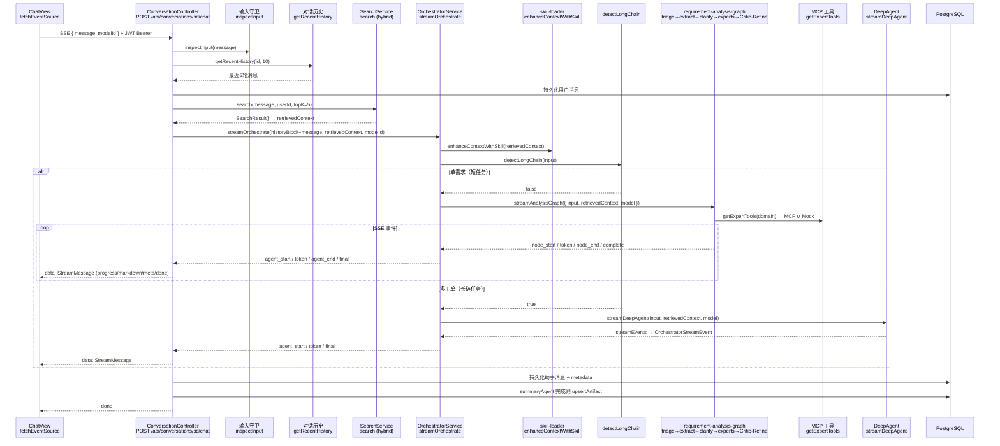
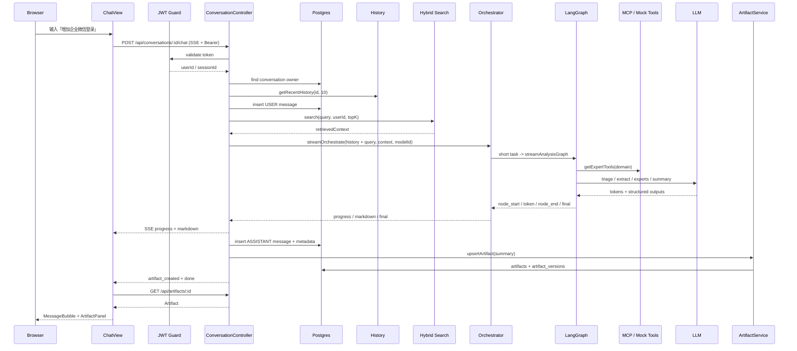
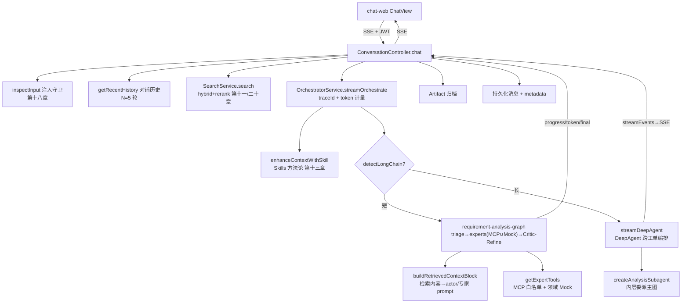
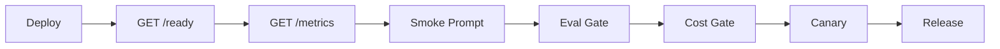
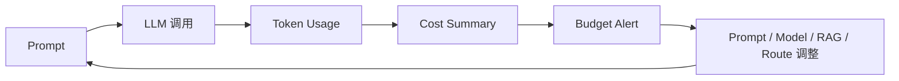
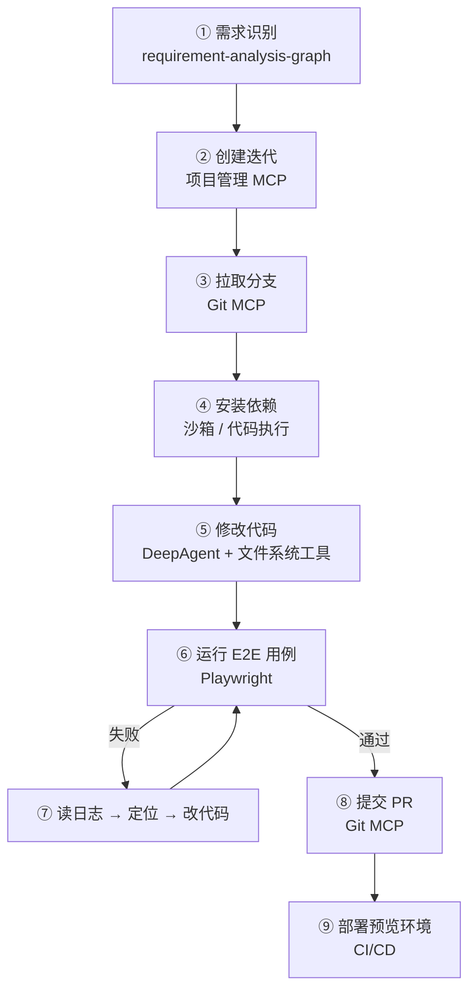
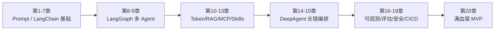

前十九章分别完成了 LangGraph 多 Agent、Token 成本治理、高级 RAG、MCP、Skills、DeepAgent，以及可观测性、评估、安全和 CI/CD 等工程能力。这些能力已经在各自章节中验证过，但大多还停留在独立模块、脚本或分层测试中，没有形成一条从前端到后端的生产主链路。

本章的目标是把这些能力接入同一条请求路径：从 ChatView 发起 SSE 请求，到 Controller 完成鉴权、历史、检索和编排，再到 LangGraph / DeepAgent 产出结果并通过 SSE 返回前端，最终得到一个前后端贯通的完整 MVP。

更重要的是，本章会用三层测试（尤其是新增的 Playwright Browser E2E）把「接进去了」和「真的能用」区分开来。贯穿全章的主线只有一条：**用行为验证而非代码验证**——一个接线点是否生效，不取决于代码看起来对不对，而取决于从浏览器端发起一次真实请求时它是否真的工作。这条原则不仅决定了本章怎么测，也指向本书最后描绘的更大目标：让系统从「分析需求」一路延伸到「交付可部署的代码」。

> **学习目标**
> *   画出满血版的端到端数据流，从 ChatView 到 SSE 返回
> *   把高级 RAG、MCP 工具、Skills、DeepAgent、对话历史逐个接进主链路
> *   理解每个接线点的验证方式——用行为验证而非代码验证
> *   能用 `chapter20-fullchain.spec.ts`、`run-fullchain-demo.ts` 和 Playwright Browser E2E 分层验证完整链路

**本章demo地址**：[feat/full-pipeline](https://github.com/Cookieboty/autix-demo/tree/feat/ch20-full-pipeline)

***

## 20.1 端到端数据流

用户在 `ChatView` 发一条「加个企业微信登录」，触发的完整链路：




本章的六个接线点依次是：hybrid RAG 检索升级、检索内容注入报告生成、MCP 工具接入、Skills 方法论注入、DeepAgent 长链路由、对话历史注入。后面的测试分层会围绕这六点逐一验证。


这条链路涉及的核心文件（均可在当前分支找到）：

| 层           | 文件                                                             | 职责                                                               |
| ----------- | -------------------------------------------------------------- | ---------------------------------------------------------------- |
| 前端          | `clients/chat-web/components/chat/ChatView.tsx`                | fetchEventSource 发起 SSE，处理 markdown/ui/progress/meta/done 事件     |
| 前端 API      | `clients/chat-web/lib/api.ts`                                  | axios 封装，会话/文档/模型/产物 REST 调用                                     |
| 控制器         | `services/chat/src/conversation/conversation.controller.ts`    | 鉴权、幂等防重、历史取、检索、编排、SSE 转发、持久化                                     |
| 消息          | `services/chat/src/message/message.service.ts`                 | `getRecentHistory` 取最近 N 条                                       |
| 检索          | `services/chat/src/document/search.service.ts`                 | `search()` hybrid 主入口，`similaritySearch()` 纯向量                   |
| 混合检索        | `services/chat/src/document/hybrid-retrieval.ts`               | BM25 + RRF 融合 + embedding 重排                                     |
| 编排          | `services/chat/src/llm/agents/orchestrator.service.ts`         | `streamOrchestrate` 主入口，Skills 注入，长链路由，DeepAgent 分支              |
| 主图          | `services/chat/src/llm/graph/requirement-analysis-graph.ts`    | LangGraph 状态图：triage→extract→clarify→experts→Critic-Refine       |
| 专家          | `services/chat/src/llm/graph/experts.ts`                       | Supervisor + 4 专家 ReAct（Reasoning and Acting，推理与行动交替）子图，MCP 工具叠加 |
| MCP         | `services/chat/src/mcp/mcp-bootstrap.ts`                       | 进程级 mcpManager 单例，启动期连接                                          |
| Skills      | `services/chat/src/skills/skill-loader.ts`                     | 读取 `SKILL.md` 的 frontmatter 与正文                                  |
| DeepAgent   | `services/chat/src/llm/deepagent/deep-orchestrator.service.ts` | 长链编排，streamEvents 转 SSE                                          |
| 安全          | `services/chat/src/security/input-guard.ts`                    | prompt injection 检测                                              |
| 启动          | `services/chat/src/app.module.ts`                              | `onApplicationBootstrap` 调 `initMcp()`                           |
| 后端测试        | `services/chat/test/chapter20-fullchain.spec.ts`               | Layer 1（零 LLM）+ Layer 2（真实 LLM 后端链路）                             |
| Browser E2E | `e2e/fullchain.browser.spec.ts`                                | Playwright 登录、ChatView、SSE、持久化、Artifact Panel 断言                 |
| Demo        | `services/chat/scripts/run-fullchain-demo.ts`                  | Backend fullchain 两个场景实跑（短/长任务）                                  |

***

## 20.2 检索升级：hybrid + rerank

### 现状

主链路原本的检索是 `SearchService.similaritySearch`——纯余弦距离的单路向量检索。第十一章在 `rag/` 目录建了 hybrid/rerank 的教学实现，但它放在 `src/` 之外，生产 `tsconfig` 的 `rootDir=./src` 跨目录 import 会触发 TS6059（TypeScript 认为被导入文件不在 `rootDir` 下）。因此，这里在 `src/document/hybrid-retrieval.ts` 放置了一份同源的生产实现。

### 接线

`SearchService` 增加 `search()` 方法作为主链路统一入口，由 `langchain.yaml` 的 `retrieval.mode` 控制策略：

```tsx
// services/chat/src/document/search.service.ts

async search(query: string, userId: string, topK = 5): Promise<SearchResult[]> {
  const mode = loadLangChainConfig().retrieval?.mode ?? 'hybrid';
  if (mode !== 'hybrid') {
    return this.similaritySearch(query, userId, topK);
  }

  try {
    const wideK = topK * 3;
    const vectorPath = () => this.similaritySearch(query, userId, wideK);
    const bm25Path = async () => {
      const corpus = await this.fetchUserChunks(userId);
      return bm25Search(query, corpus, wideK);
    };
    const candidates = await hybridSearch(query, vectorPath, bm25Path, wideK);
    if (candidates.length === 0) return [];
    return embeddingRerank(query, candidates,
      (texts) => this.embedding.embedTexts(texts), topK);
  } catch (err) {
    console.warn('[SearchService] hybrid 检索失败，降级纯向量:', err);
    return this.similaritySearch(query, userId, topK);
  }
}
```

三段式流程：向量 + BM25 两路多召回（`topK*3`，提高 Recall）→ RRF 融合去重 → embedding 余弦重排精排到 `topK`（提高 Precision）。BM25 是基于词频和逆文档频率的字面检索算法，适合命中专有名词、编号和配置项；RRF（Reciprocal Rank Fusion，倒数排名融合）按各路结果的名次累加 `1/(K+rank)`，其中 `K` 是平滑常数，用来降低极靠前名次的分数差异。这个流程对应第十七章 17.3 的 Recall/Precision 两步优化。

BM25 实现在 `hybrid-retrieval.ts`，在内存里对用户的 chunks（上限 500）计算 BM25（latin 按词、CJK 按单字）：

```tsx
// services/chat/src/document/hybrid-retrieval.ts

export function tokenize(text: string): string[] {
  if (!text) return [];
  const latin = text.toLowerCase().match(/[a-z0-9]+/g) ?? [];
  const cjk = text.match(/[\u4e00-\u9fff]/g) ?? [];
  return [...latin, ...cjk];
}

export function bm25Search(query: string, corpus: RetrievalResult[], topK = 5): RetrievalResult[] {
  // ... BM25 打分：IDF × TF/(K1+TF)，K1 控制词频饱和程度；零命中过滤
}

export async function hybridSearch(
  query: string, vectorSearch: RetrieveFn, bm25Search: RetrieveFn, topK = 5,
): Promise<RetrievalResult[]> {
  const [vec, bm25] = await Promise.all([vectorSearch(query), bm25Search(query)]);
  // RRF 融合：1/(K+rank)，不归一化原始分数，只看各路内部排名
  // ...
}

export async function embeddingRerank(
  query: string, candidates: RetrievalResult[],
  embed: (texts: string[]) => Promise<number[][]>, topK = 5,
): Promise<RetrievalResult[]> {
  // query 与每个候选算 embedding，按余弦精排
  // ...
}
```

Controller 里的调用点：

```tsx
// services/chat/src/conversation/conversation.controller.ts (line ~297)

searchResults = await this.searchService.search(
  body.message as string,
  userId,
  topK,
);
```

hybrid 任一路失败时都会降级到纯向量检索，避免影响主链路。将 `retrieval.mode` 设为 `simple`，可以完全退回原有行为。

### 一个被 E2E 暴露的问题：失败 ≠ 挂起

上面的 `try/catch` 只能处理「检索抛错」，不能处理「检索挂起」。Layer 3 浏览器 E2E 第一次实跑时，前端发送消息后，整条 SSE 连接 90 秒内没有任何字节返回——既没有错误，也没有报告。逐层定位后发现：本地没有启动 Qdrant，同时 embedding 模型（`@xenova/transformers` 的 MiniLM）权重未完整下载，`embedTexts` 在 `pipeline()` 处长期阻塞。由于 `Promise.all([向量路, BM25 路])` 一直无法 resolve，`search()` 也随之挂起，Controller 在调用 orchestrator 之前就被卡住。

`try/catch` 对这种「不抛错的挂起」无能为力。修复方式是在检索外层增加**硬超时**：一旦超过阈值，就降级为空上下文，主链路继续执行：

```tsx
// services/chat/src/document/search.service.ts

const DEFAULT_SEARCH_TIMEOUT_MS = 8000; // 可被 langchain.yaml 的 retrieval.timeoutMs 覆盖

async search(query: string, userId: string, topK = 5): Promise<SearchResult[]> {
  const cfg = loadLangChainConfig().retrieval;
  const timeoutMs = cfg?.timeoutMs ?? DEFAULT_SEARCH_TIMEOUT_MS;
  try {
    return await this.withTimeout(
      this.runSearch(query, userId, topK, cfg?.mode ?? 'hybrid'),
      timeoutMs,
      'RAG 检索',
    );
  } catch (err) {
    // 失败或超时都降级为空上下文，主链路以「无相关参考文档」继续
    console.warn('[SearchService] 检索失败/超时，降级为空上下文，主链路继续:', err);
    return [];
  }
}

private withTimeout<T>(p: Promise<T>, ms: number, label: string): Promise<T> {
  let timer: ReturnType<typeof setTimeout>;
  const timeout = new Promise<never>((_, reject) => {
    timer = setTimeout(() => reject(new Error(`${label} 超时（>${ms}ms）`)), ms);
  });
  return Promise.race([p, timeout]).finally(() => clearTimeout(timer));
}
```

增加超时后，同一条链路从「90 秒没有任何事件」变成「8.2 秒后完成降级，随后收到首个 agent 事件」。「检索不能拖垮主链路」这条原则，必须同时覆盖抛错和挂起两类故障。

***

## 20.3 检索内容注入报告生成

### 问题

主链路已经把检索结果写入 graph state 的 `retrievedContext`，但真正生成报告的 Critic-Refine `actorNode`，以及四个专家的 `agentNode`，都没有读取这部分内容。原因是第八章 8.6 引入 Critic-Refine 子图时，原来的 `summaryStep` 被替换为 `createSummarySubGraph`，新子图的 `actorNode` 在重写 prompt 时遗漏了 `retrievedContext`。

### 修复

抽一个共享 helper，`actorNode` 和每个专家 `agentNode` 都注入 `state.retrievedContext`：

```tsx
// services/chat/src/llm/graph/requirement-analysis-graph.ts (line 304)

export function buildRetrievedContextBlock(retrievedContext?: string): string {
  const ctx = (retrievedContext ?? '').trim();
  if (!ctx || ctx === '无相关参考文档') return '';
  return `\n\n## 参考资料（来自知识库检索）\n${ctx}\n请优先依据以上资料作答，资料未覆盖处再用通用知识，不要编造资料中没有的事实。`;
}
```

消费点：

1.  **`actorNode`**（Critic-Refine 子图，写报告）：`contextBlock` 追加到 actor 的 system prompt 末尾
2.  **`experts.ts` 各专家 `agentNode`**：

```tsx
// services/chat/src/llm/graph/experts.ts (line 14)

import { buildRetrievedContextBlock } from './requirement-analysis-graph';

// 专家 system prompt 末尾追加
{ role: 'system', content: systemPrompt + buildRetrievedContextBlock(state.retrievedContext) }
```

修复后，数据流闭合为：检索 → state → 报告/专家 prompt 消费 → 输出体现知识库内容。

实现上需要注意两点。第一，注入逻辑统一收敛到 `buildRetrievedContextBlock`，而不是在 actor 和每个专家节点分别拼接 prompt。多个节点各写一份注入逻辑，容易出现「改了一处、漏了一处」的问题；共享 helper 可以避免后续节点之间的逻辑漂移。第二，helper 会过滤空字符串和 `无相关参考文档` 这个占位值。检索为空或超时时，主链路会用占位文本兜底（见 20.2 的超时降级）；如果不拦截它，就会把「无相关参考文档」当成真实资料写进 prompt，干扰模型判断。只有检索确实返回内容时，才应该注入参考资料块。

***

## 20.4 MCP 工具接入

### 接线

三步完成：

**第一步**，`mcp-bootstrap.ts` 暴露进程级 `mcpManager` 单例，在 `AppModule.onApplicationBootstrap` 里连接两个 stdio server：

```tsx
// services/chat/src/mcp/mcp-bootstrap.ts

export const mcpManager = new MCPManager();

export async function initMcp(): Promise<void> {
  mcpManager.register({
    id: 'requirement-analyzer', prefix: '',
    config: { command: 'bun', args: [serverEntry('requirement-analyzer')] },
  });
  mcpManager.register({
    id: 'web-search', prefix: '',
    config: { command: 'bun', args: [serverEntry('web-search')] },
  });
  try { await mcpManager.connectAll(); }
  catch { /* 连不上 → getTools()=[] → 专家降级 Mock */ }
}
```

注册时 `prefix: ''` 保留原始工具名，否则第十八章 `isAllowed` 白名单（按原始名登记）会把带前缀的工具名全部过滤掉。

```tsx
// services/chat/src/app.module.ts (line 44)

async onApplicationBootstrap() {
  await initMcp();
}
```

**第二步**，专家工具集 = MCP 工具（已白名单过滤）∪ 该领域 Mock 工具：

```tsx
// services/chat/src/llm/graph/experts.ts (line 50)

export function getExpertTools(domain: string): any[] {
  const mock = MOCK_TOOLS[domain] ?? [];
  try {
    const mcpTools = mcpManager.getTools();
    return [...mcpTools, ...mock];
  } catch {
    return mock;
  }
}
```

这里采用「∪」而不是「替换」。专家 prompt 中已经明确要求调用各自领域的 Mock 工具名（如 `check_security_policy`），如果直接用 MCP 工具替换 Mock 工具，prompt 中的工具引用就会失效。MCP 工具（如 `analyze_completeness`、`web_search`）提供的是通用能力，应叠加在领域 Mock 工具之上。

**第三步**，当 MCP 无法连接时，`getTools()=[]`，专家退回纯 Mock 工具，避免工具层故障中断分析流程。

`mcpManager` 采用进程级单例，连接动作放在 `onApplicationBootstrap` 启动钩子中，而不是每次请求临时连接。MCP 的 stdio server 是独立子进程，建立连接、握手、拉取工具清单都有固定开销；如果放到请求路径上，每条用户请求都会增加一次连接延迟，并发时还可能反复拉起子进程。启动期连接一次、在进程生命周期内复用，可以降低单次请求延迟，并让服务运行期间的工具清单保持稳定。代价是启动时间略有增加，且 server 崩溃后需要重连机制。连接失败时采用降级而非抛错，是为了避免外部工具进程影响主服务启动。

MCP server 位于仓库根目录的 `mcp-servers/`。其中 `web-search` 在缺少 `TAVILY_API_KEY` 时会自动使用 mock 行为，因此即使没有外部 key，也可以完成连接和验证。

***

## 20.5 Skills 方法论注入

第十三章把需求分析方法论沉淀到了 `src/skills/definitions/requirement-analysis/SKILL.md`，但主链路尚未加载这份能力说明。`skill-loader.ts` 负责读取 `SKILL.md` 的 YAML frontmatter 与正文：

```tsx
// services/chat/src/skills/skill-loader.ts

export function loadSkill(name: string): LoadedSkill | null {
  try {
    const raw = fs.readFileSync(skillPath(name), 'utf8');
    const m = raw.match(/^---\n([\s\S]*?)\n---\n?([\s\S]*)$/);
    if (!m) return { name, content: raw.trim() };
    const meta = (yaml.load(m[1]) ?? {}) as { name?: string; description?: string };
    return { name: meta.name ?? name, description: meta.description, content: m[2].trim() };
  } catch { return null; }
}
```

Orchestrator 在调用图之前把方法论前置注入到 `retrievedContext`：

```tsx
// services/chat/src/llm/agents/orchestrator.service.ts (line 64)

private enhanceContextWithSkill(retrievedContext: string): string {
  const base = retrievedContext || '无相关参考文档';
  const skill = loadSkill('requirement-analysis');
  if (!skill) return base;
  return `## 分析方法论（Skill: ${skill.name}）\n${skill.content}\n\n${base}`;
}
```

方法论会被拼接到 `retrievedContext` 中，并复用 20.3 的注入通道，只进入读取检索上下文的 actor / 专家节点。这里的分工是：RAG 补充「知道什么」（业务事实），Skills 补充「怎么做」（分析方法）。当 skill 不可用时，函数会返回原始上下文，不影响主链路执行。

RAG 和 Skills 共用同一条注入通道，可以避免再新增一套上下文拼装逻辑，但两者的职责不同。RAG 提供「这次需求相关的业务事实」，每次请求都不同，强依赖检索结果；Skills 提供「分析这类需求该遵循的方法论」，相对稳定，与具体输入弱相关。代码中把 Skills 放在拼接串最前面（`方法论` 在前、检索资料在后），是为了先给模型分析框架，再提供事实材料。Skills 注入只发生在主图分支；DeepAgent 长链分支有自己的规划与子图委派逻辑（见 20.6），不复用这条通道。因此，长任务的方法论约束需要单独设计，不能默认这里注入一次就覆盖全链路。

***

## 20.6 DeepAgent 长链路由

这是影响最大的接线点，因为它改变了 orchestrator 的路由逻辑。

### 长链判定

```tsx
// services/chat/src/llm/agents/orchestrator.service.ts (line 45)

export function detectLongChain(input: string): boolean {
  const reqIds = input.match(/REQ-?\d+/gi) ?? [];
  const distinct = new Set(reqIds.map((s) => s.toUpperCase().replace(/-/g, '')));
  return distinct.size >= 2;
}
```

当输入中包含 ≥2 个不同 REQ 编号时，路由到 DeepAgent；单需求仍然走现有主图。这个判断是纯函数，不依赖 LLM，因此可以在 Layer 1 确定性测试中直接断言。判定规则刻意保持保守：只识别显式的多工单信号，不做模糊推断。

这里没有使用 LLM 做路由判断，原因是路由位于整条链路的第一个分叉点，需要低延迟、低成本、可复现。LLM 判定会额外增加一次模型调用，结果也可能随模型版本和上下文波动，测试与复现成本都更高。正则匹配显式 REQ 编号虽然保守，但具备零模型成本、低延迟、可断言的优势。

误判成本也需要考虑：把长任务误判成短任务，会让主图缺少跨工单的全局协调；把短任务误判成长任务，则会引入 DeepAgent 规划编排的额外开销。因此，当前版本只识别「用户明确写出多个工单编号」这一强信号，把模糊场景交给主图处理。后续如果线上 badcase 显示这种规则不够，再引入更复杂的判定策略。

### 路由分支

```tsx
// services/chat/src/llm/agents/orchestrator.service.ts — streamOrchestrate (line 444)

if (detectLongChain(input)) {
  yield* this.streamDeepAgent(input, retrievedContext, model);
  return;
}
// 否则走主图
const graphStream = streamAnalysisGraph({
  input,
  retrievedContext: this.enhanceContextWithSkill(retrievedContext),
  model,
});
```

### DeepAgent → SSE 协议转换

`streamDeepAgent` 会把第十五章 `createDeepOrchestrator` 的 `streamEvents(v2)` 转换为主链路使用的 `OrchestratorStreamEvent`。这样前端不需要感知路由分支：无论走主图还是 DeepAgent，前端收到的都是同一套 progress / token / final 协议：

```tsx
// services/chat/src/llm/agents/orchestrator.service.ts (line 682)

private async *streamDeepAgent(
  input: string, retrievedContext: string, model: BaseChatModel,
): AsyncGenerator<OrchestratorStreamEvent> {
  const { createDeepOrchestrator } = await import('../deepagent/deep-orchestrator.service');
  const { MemorySaver } = await import('@langchain/langgraph');
  const agent = createDeepOrchestrator({ model, checkpointer: new MemorySaver() });

  const threadId = `deep-${Date.now()}-${Math.random().toString(36).slice(2, 8)}`;
  for await (const ev of agent.streamEvents(
    { messages: [{ role: 'user', content: ctx }] },
    { version: 'v2', configurable: { thread_id: threadId } },
  )) {
    switch (ev.event) {
      case 'on_tool_start':
        yield { type: 'agent_start', agent: ev.name, step: ++step, totalSteps: 0 };
        break;
      case 'on_chat_model_stream':
        const content = typeof chunk?.content === 'string' ? chunk.content : '';
        if (content) yield { type: 'token', content, agent: 'deepOrchestrator' };
        break;
      case 'on_tool_end':
        yield { type: 'agent_end', agent: ev.name, step };
        break;
    }
  }

  yield { type: 'final', result: { /* ... */ report } };
}
```

一旦启用 `checkpointer`（这里是 MemorySaver），就必须传入 `thread_id`，否则 checkpointer 在保存状态时报错。生产环境应改为 `PostgresSaver`，这会新增 LangGraph checkpoint 相关表，属于数据模型变更。

***

## 20.7 对话历史注入

主链路此前每轮只传入当前消息，不携带历史上下文。在多轮对话中，如果用户追问「那它的安全风险呢」，模型无法判断「它」指代上一轮中的哪个需求。

历史读取放在 **controller**（DB 归属层），不在 orchestrator——`OrchestratorService` 设计上不做 DB 操作：

```tsx
// services/chat/src/message/message.service.ts (line 33)

async getRecentHistory(conversationId: string, take: number) {
  const rows = await this.prisma.messages.findMany({
    where: { conversationId },
    orderBy: { createdAt: 'desc' },
    take,
  });
  return rows.reverse();
}
```

Controller 在持久化当前消息**之前**取最近 N 轮，拼成历史块前置到 `input`：

```tsx
// services/chat/src/conversation/conversation.controller.ts (line 260)

const CHAT_HISTORY_TURNS = 5;

let historyBlock = '';
if (!isUIAction) {
  const recent = await this.messageService.getRecentHistory(id, CHAT_HISTORY_TURNS * 2);
  if (recent.length > 0) {
    historyBlock =
      '## 对话历史（最近若干轮，供理解上下文/代词指代）\n' +
      recent.map((m) =>
        `${m.role === MessageRole.USER ? '用户' : '助手'}：${m.content}`,
      ).join('\n') +
      '\n\n## 当前问题\n';
  }
}

// 传给 orchestrator
const orchestratorInput = isUIAction
  ? (messageContent as string)
  : `${historyBlock}${body.message as string}`;
```

UI 操作不注入历史，仍然使用原始消息内容。N=5 轮（10 条消息）作为起步默认值：多数需求分析对话能在 5 轮内收敛，token 成本也相对可控。更长的深度对话应结合第十章的摘要式记忆。

历史注入有两个关键点。第一，历史必须在当前消息落库**之前**读取。Controller 随后会把这一轮用户消息写进 `messages` 表；如果先写后读，刚发送的内容会被 `getRecentHistory` 当成「历史」再次拼进 `input`，导致当前问题在 prompt 中出现两次。第二，历史读取放在 Controller，而不是 Orchestrator。`OrchestratorService` 只负责编排，不直接访问数据库；会话归属、消息读写等持久化职责统一留在 Controller。这样 Orchestrator 始终保持为「输入文本，输出事件流」的编排单元，便于测试，也便于 demo 脚本、批量评估等入口复用。当前实现直接拼接历史原文，是最简单可用的形态；随着对话变长，需要切换到第十章讨论的摘要式记忆，而不是持续堆叠原文。

***

## 20.8 前端 SSE 协议

第六章已经把输出形态从纯 Markdown 推进到结构化 UI 和流式交互；本章在这个基础上确认生产链路中的前端协议。`ChatView` 使用 `@microsoft/fetch-event-source` 发起 SSE 连接，并处理全部事件类型：

```tsx
// clients/chat-web/components/chat/ChatView.tsx (line 372)

await fetchEventSource(
  `${CHAT_API_URL}/api/conversations/${activeSessionId}/chat`,
  {
    method: 'POST',
    headers: {
      'Content-Type': 'application/json',
      Authorization: `Bearer ${token}`,
    },
    body: JSON.stringify({ message: content, modelId: selectedModelId ?? undefined }),
    signal: abortRef.current.signal,

    onmessage(event) {
      const msg = JSON.parse(event.data) as StreamMessage;
      switch (msg.messageType) {
        case 'markdown':
          // 流式追加 Markdown 内容
          appendToLastAssistantMessage(activeSessionId, markdownPayload.content);
          break;
        case 'ui':
          // 渲染 AIUIRenderer 交互组件
          updateStreamingMessage('', { messages: uiPayload.components });
          break;
        case 'progress':
          // 更新 ThinkingIndicator（并行专家单独维护）
          if (progressPayload.parallel) setParallelAgent(info);
          else setProgress(info);
          break;
        case 'meta':
          // 更新 UI stage
          setStage(metaPayload.uiStage);
          break;
        case 'artifact_created':
          // 加载并展示 ArtifactPanel
          artifactApi.getArtifact(artifactCreatedPayload.artifactId)...
          break;
        case 'done':
          setStreaming(false);
          clearProgress();
          break;
        case 'error':
          setStreaming(false);
          abortRef.current?.abort();
          break;
      }
    },
  }
);
```

前端**不需要区分**主图和 DeepAgent。两条分支经过 orchestrator 转换后，都会输出同一套 SSE 协议。前端只需要稳定处理 `markdown/ui/progress/meta/artifact_created/done/error` 七种事件类型。

统一事件协议是前后端解耦的关键。后端编排策略可能变化：当前是主图与 DeepAgent 两条分支，后续也可能加入新的路由目标或替换底层框架。如果前端需要感知每次请求走哪条分支，后端每新增一种编排方式，前端都要跟着修改渲染逻辑。将所有分支收敛为同一套 progress / token / final 语义事件，相当于在 orchestrator 层提供稳定契约：前端只处理事件协议，不关心背后的 Agent 类型。20.6 中 `streamDeepAgent` 把 `streamEvents(v2)` 翻译成 `OrchestratorStreamEvent`，就是为了把 DeepAgent 内部事件转换成前端已经支持的消息类型。

Controller 端 SSE 转发的完整映射：

| orchestrator 事件                 | SSE messageType               | 前端处理                                         |
| ------------------------------- | ----------------------------- | -------------------------------------------- |
| `agent_start`                   | `progress` (status=started)   | `ThinkingIndicator` 显示步骤，parallel 专家单独列      |
| `token`                         | `markdown` (isChunk=true)     | 流式追加到消息气泡                                    |
| `agent_end`                     | `progress` (status=completed) | 步骤完成                                         |
| `log`                           | `log`                         | console 输出                                   |
| `final` (responseType=markdown) | `markdown` (isChunk=false)    | 完整报告                                         |
| `final` (responseType=ui)       | `ui`                          | 渲染交互组件                                       |
| —                               | `meta`                        | 更新 uiStage / usedAgents / retrievedDocuments |
| —                               | `artifact_created`            | 加载产物面板                                       |
| —                               | `done`                        | 结束流                                          |

### 一个 SSE 端的工程细节

1.  **要发送 keep-alive 心跳。** 完整链路中的 Critic-Refine 等节点，可能连续数十秒只产出结构化结果而不输出 token。长时间没有字节返回时，浏览器或中间代理可能把连接判定为空闲并断开，导致 `artifact_created` 事件尚未发出，前端连接就已经结束。Controller 每 15 秒发送一个 SSE 注释行（以 `:` 开头，客户端会忽略）用于保活，并在 `finally` 中通过 `clearInterval` 清理定时器：

```tsx
// services/chat/src/conversation/conversation.controller.ts
res.statusCode = HttpStatus.OK; // SSE 约定 200，覆盖 POST 默认的 201
res.flushHeaders();

const keepAlive = setInterval(() => {
  if (!res.writableEnded) res.write(': keepalive\n\n');
}, 15_000);
// ... 流式输出 ...
// finally { clearInterval(keepAlive); res.end(); }
```

***

## 20.9 横切能力确认

六个接线点完成后，还需要确认第十六至十九章的横切能力在完整链路上仍然有效：

| 横切能力       | 在满血链路上的体现                                                                         |
| ---------- | --------------------------------------------------------------------------------- |
| 可观测（第十六章）  | 每次 LLM 调用有 `withTokenUsage` 包裹，token 落 `token_usages` 表；`createLogger` 结构化日志贯穿各节点 |
| 评估（第十七章）   | eval runner 跑的是满血链路（hybrid RAG + 真工具），评的是真实生产质量                                   |
| 安全（第十八章）   | Controller 调 `inspectInput` 做 injection 检测；MCP 工具经 `isAllowed` 白名单过滤；apiKey 返回脱敏  |
| CICD（第十九章） | Layer 1 测试每次 CI 跑；compose 一键起全套依赖                                                 |

这四项能力需要单独确认，因为它们不归属于某一个接线点，而是横跨整条链路。集成改动后，常见风险包括：某个节点漏掉 token 计量、injection 守卫被绕过、或新分支没有进入 CI。确认横切能力仍然有效，就是确认这次集成没有以牺牲可观测性、安全或质量为代价。

***

## 20.10 测试：Layer 1 + Layer 2 + Layer 3

到这一章，测试不能只验证「某个函数是否正确」。完整链路至少要分三层验证：

| 层级      | 覆盖对象                                   | 频率                     | 代价            |
| ------- | -------------------------------------- | ---------------------- | ------------- |
| Layer 1 | 纯函数、协议转换、降级逻辑                          | 每次 PR                  | 快、零 LLM、确定    |
| Layer 2 | 真实 LLM 后端链路（Graph / Orchestrator）      | nightly / 手动           | 慢、花 token、有波动 |
| Layer 3 | 真实 Browser + 前后端 + SSE + DB + Artifact | nightly / release gate | 最慢、最接近用户视角    |

`services/chat/test/chapter20-fullchain.spec.ts` 覆盖 Layer 1 和 Layer 2。`e2e/fullchain.browser.spec.ts` 覆盖 Layer 3。这样分层以后，每个 PR 仍然可以保持较低成本；在发布前，再通过 Browser E2E 补上用户视角的闭环验证。


### Layer 1：零 LLM、确定性（CI 常跑）

```tsx
// services/chat/test/chapter20-fullchain.spec.ts

// 20.6 长链路由
describe('20.6 长链路由 detectLongChain', () => {
  it('多工单输入（≥2 个不同 REQ）路由到 DeepAgent', () => {
    expect(detectLongChain('评估 REQ-001/REQ-002/REQ-003 的总体影响')).toBe(true);
    expect(detectLongChain('REQ-1 和 REQ-2 有冲突吗')).toBe(true);
  });

  it('单需求 / 单 REQ / 重复同一 REQ 路由到主图', () => {
    expect(detectLongChain('加个登录功能')).toBe(false);
    expect(detectLongChain('看下 REQ-001 的状态')).toBe(false);
    expect(detectLongChain('REQ-001 又是 REQ-001')).toBe(false);
  });
});

// 20.3 检索上下文注入
describe('20.3 检索上下文注入 buildRetrievedContextBlock', () => {
  it('空 / 占位文本不注入', () => {
    expect(buildRetrievedContextBlock('')).toBe('');
    expect(buildRetrievedContextBlock(undefined)).toBe('');
    expect(buildRetrievedContextBlock('无相关参考文档')).toBe('');
  });

  it('有检索内容时注入「参考资料」块', () => {
    const block = buildRetrievedContextBlock('企业微信登录走 OAuth2 授权码模式');
    expect(block).toContain('参考资料');
    expect(block).toContain('OAuth2 授权码');
  });
});

// 20.4 MCP 降级
describe('20.4 MCP 降级', () => {
  it('MCP 未连接时 getExpertTools 只返回该领域 Mock 工具', () => {
    const security = getExpertTools('security').map((t) => t.name);
    expect(security).toEqual(['check_security_policy', 'list_auth_scenarios']);
  });

  it('未知领域返回空数组', () => {
    expect(getExpertTools('unknown-domain')).toEqual([]);
  });
});

// 20.2 hybrid 检索后端
describe('20.2 hybrid 检索后端', () => {
  it('tokenize 中英混合：latin 按词、CJK 按单字', () => {
    expect(tokenize('OAuth2 企业微信')).toEqual(['oauth2', '企', '业', '微', '信']);
  });

  it('bm25Search 把命中查询词的文档排前面', () => {
    const corpus = [
      mkDoc('a', '企业微信登录需要 OAuth2 授权码模式'),
      mkDoc('b', '今天天气不错适合散步'),
      mkDoc('c', '微信支付与账单结算'),
    ];
    const ranked = bm25Search('企业微信 OAuth2', corpus, 3);
    expect(ranked[0].chunkId).toBe('a');
    expect(ranked.find((r) => r.chunkId === 'b')).toBeUndefined();
  });

  it('hybridSearch 用 RRF 融合两路、去重', async () => {
    const vector = async () => [mkDoc('a', 'x'), mkDoc('b', 'y')];
    const bm25 = async () => [mkDoc('b', 'y'), mkDoc('c', 'z')];
    const fused = await hybridSearch('q', vector, bm25, 3);
    expect(fused[0].chunkId).toBe('b'); // b 在两路都靠前 → RRF 分最高
  });

  it('embeddingRerank 按 query 余弦相似度精排', async () => {
    const candidates = [mkDoc('a', 'aaa'), mkDoc('b', 'bbb')];
    const embed = async () => [[1, 0], [0, 1], [1, 0]];
    const reranked = await embeddingRerank('q', candidates, embed, 2);
    expect(reranked[0].chunkId).toBe('b');
  });
});
```

10 个 `it`，覆盖路由判定、检索上下文注入、MCP 降级、BM25/RRF/重排后端，每次 CI 都跑。

### Layer 2：真实 LLM 后端链路（需 OPENAI\_API\_KEY，无 key 自动跳过）

```tsx
// services/chat/test/chapter20-fullchain.spec.ts — Layer 2

describe('20.3 RAG 修复后，报告真正消费检索内容', () => {
  it('报告里出现知识库特有术语', async () => {
    const retrievedContext =
      '[知识库] 企业微信登录必须使用 OAuth2 授权码模式，并在回调时校验 corpId。';
    const result = await runAnalysisGraph({
      input: '为后台管理系统增加企业微信扫码登录',
      retrievedContext,
      model,
    });
    expect(result.summary).toMatch(/OAuth2|授权码|corpId/i);
  }, 180_000);
});

describe('20.6 长链输入端到端路由到 DeepAgent', () => {
  it('多工单输入触发 DeepAgent 分支并返回非空报告', async () => {
    const orch = new OrchestratorService({} as never, {} as never);
    const input = '评估 REQ-001 与 REQ-002 的总体影响和冲突';
    expect(detectLongChain(input)).toBe(true);

    let routedToDeep = false;
    let report = '';
    for await (const ev of orch.streamOrchestrate(input, '无相关参考文档', undefined)) {
      if (ev.type === 'log' && ev.message.includes('DeepAgent')) routedToDeep = true;
      if (ev.type === 'final') report = ev.result.report ?? '';
    }
    expect(routedToDeep).toBe(true);
    expect(report.length).toBeGreaterThan(0);
  }, 300_000);
});
```

Layer 2 验证的是**后端行为**——注入特征事实后报告正文出现对应术语（证明检索→报告数据流真正闭合），多工单输入走 DeepAgent 分支并产出非空报告。

但这还不是严格意义上的 E2E。它绕过了 Browser、登录、JWT、`fetchEventSource`、Nest Controller、消息持久化和 Artifact Panel。`chapter20-fullchain.spec.ts` 能证明主编排链路有效，却不能证明用户可以从页面完成一次分析。

运行：

```bash
cd services/chat

# 只跑 Layer 1（无需 API key）
bun test test/chapter20-fullchain.spec.ts

# 含 Layer 2（需 API key，会产生真实 LLM 调用）
OPENAI_API_KEY=... bun test test/chapter20-fullchain.spec.ts
```

### Layer 3：Browser E2E（Playwright）

真正意义上的端到端链路应该是：

    Browser
    ↓
    ChatView
    ↓
    fetchEventSource / SSE
    ↓
    JWT
    ↓
    Nest Controller
    ↓
    LangGraph / DeepAgent
    ↓
    LLM
    ↓
    Postgres
    ↓
    Artifact
    ↓
    Browser Assert

本章新增 `e2e/fullchain.browser.spec.ts`，用 Playwright 从用户视角跑一条短任务链路：

```tsx
// e2e/fullchain.browser.spec.ts（节选）

test('login -> ChatView -> SSE -> Controller -> DB -> Artifact -> browser assert', async ({
  page,
  request,
}) => {
  await page.goto('/login');
  await page.getByLabel('账号').fill('admin');
  await page.getByLabel('密码').fill('Admin@123456');
  await page.getByRole('button', { name: /开始对话/ }).click();

  await expect(page.getByText('Chat workspace')).toBeVisible();
  const token = await page.evaluate(() => localStorage.getItem('accessToken'));

  // 测试自我隔离：用同一个 JWT 新建一个空会话再导航进去，避免 ChatView 默认加载到
  // 历史会话（可能已带旧 artifact）导致面板「秒出」的假阳性——断言的就是本次链路的新产物。
  const authHeaders = { Authorization: `Bearer ${token}` };
  const fresh = await request.post('http://localhost:4001/api/conversations', {
    headers: authHeaders, data: { title: `e2e-fullchain-${Date.now()}` },
  });
  const freshId = unwrapData<{ id: string }>(await fresh.json()).id;
  await page.goto(`/c/${freshId}`);

  await page.getByLabel('消息输入框').fill(
    '为后台管理系统增加企业微信扫码登录。要求使用 OAuth2 授权码模式，回调校验 corpId。',
  );
  const chatResponsePromise = page.waitForResponse(
    (r) => r.url().includes('/api/conversations/') && r.url().endsWith('/chat'),
  );
  await page.getByRole('button', { name: '发送消息' }).click();
  const chatResponse = await chatResponsePromise;
  expect(chatResponse.status()).toBe(200); // SSE 约定 200（见 20.8，已修复 NestJS POST 默认 201）

  // 满血链路要等真实 LLM 全图（含 Critic-Refine 循环）跑到 summaryAgent 完成、后端 upsertArtifact、
  // 再经 artifact_created SSE 事件加载面板。实测慢推理模型下约 380s 到达，故给 9 分钟余量。
  await expect(page.locator('#artifact-panel')).toBeVisible({ timeout: 540_000 });
  await expect(page.locator('#artifact-panel')).toContainText(
    /企业微信|OAuth2|授权码|corpId|扫码登录|安全风险|验收标准/i,
  );

  const messages = await request.get(
    `http://localhost:4001/api/conversations/${freshId}/messages`,
    { headers: authHeaders },
  );
  expect(messages.ok()).toBeTruthy();

  const artifact = await request.get(
    `http://localhost:4001/api/artifacts/conversation/${freshId}`,
    { headers: authHeaders },
  );
  expect(artifact.ok()).toBeTruthy();
});
```

> **两个让 Layer 3 真正稳定的细节**
> *   **会话隔离**：必须为每次运行新建会话。否则 `ChatView` 默认加载最近一条会话。如果这条会话已经包含 artifact，面板会立即出现，造成假阳性；`getByText('企业微信扫码登录')` 这类宽松匹配还可能同时命中侧栏标题和用户气泡，触发 Playwright strict-mode 冲突。
> *   **超时要贴合真实耗时**：完整短任务在慢推理模型上从发消息到 artifact 实测约 **380s**（Critic-Refine 多轮 + 模型本身慢）。`playwright.config.ts` 整测超时设 12 分钟、面板等待设 9 分钟，并配合 20.8 的 SSE keep-alive 防止长链中途断连。

它覆盖了五个容易被后端测试遗漏的点：

1.  **登录与 JWT**：从 `user-system` 登录，前端把 `accessToken` 存入 `localStorage`，后续请求带 `Bearer`。
2.  **ChatView 与 SSE**：不是直接调 orchestrator，而是由 `ChatInput` 触发 `fetchEventSource`。
3.  **Controller 与 DB**：消息经 `ConversationController.chat` 落入 `messages` 表，测试再查 `/api/conversations/:id/messages`。
4.  **Artifact Panel**：`summaryAgent` 完成后后端 `upsertArtifact`，再通过 `artifact_created` SSE 事件让前端加载 `ArtifactPanel`。
5.  **部署探针**：同一次测试还访问 `/ready`、`/metrics`、`/api/cost/summary`，确认上线后验证入口可用。

它**不覆盖**的两条路径要说清楚，避免误以为「一条 E2E 测全了」：

*   **DeepAgent 长链分支（20.6）**：本测试发的是单需求短任务，走主图；多工单输入触发的 DeepAgent 路由由 Layer 2 的 `20.6 长链输入端到端路由到 DeepAgent` 覆盖。
*   **多轮历史注入（20.7）**：本测试只发一条消息，不验证代词指代/历史拼接，这部分目前只在 Controller 单测层面覆盖。

也就是说，三层测试是互补的：Layer 3 保「用户能从浏览器走通一次短任务」，长链与多轮交给 Layer 1/2。要把长链也拉到浏览器层，照本测试的结构换成多工单提示词、并相应放宽超时即可。

运行前先启动完整服务：

```bash
cd infra/compose
POSTGRES_PASSWORD=postgres OPENAI_API_KEY=... docker compose up --build

cd ../..
RUN_BROWSER_E2E=1 bun run test:e2e
```

这类测试执行时间长、会花 token、偶尔受模型输出波动影响，因此不建议放进每个 Pull Request。推荐策略是：

| 流水线          | 跑什么                                                   |
| ------------ | ----------------------------------------------------- |
| 每次 PR        | Layer 1：typecheck / lint / unit / deterministic tests |
| Nightly      | Layer 2：真实 LLM 后端链路 + eval                            |
| Release Gate | Layer 3：Playwright Browser E2E + deployment smoke     |

### 本地实跑验证

这条 Layer 3 不是「写完测试就结束」——它已经完成过一次真实运行，结果为 `1 passed (7.1m)`：真实 Chromium 登录并获取 JWT → `ChatView` 发起 `fetchEventSource` → Controller 返回 SSE 200 → LangGraph 执行完整 agent 链路（extract / clarify / analysis / risk / summary + Critic-Refine）→ 示例环境中的默认模型生成结果（本书示例配置为 `gpt-5.4`）→ Postgres 持久化消息 → `upsertArtifact` 写入产物 → `artifact_created` 事件通知前端 → `ArtifactPanel` 渲染 → 浏览器断言与 REST 断言全部通过。产物正文包含 OAuth2、corpId、授权码等关键术语。

测试在四个关键节点各截了一张图（由 `page.screenshot()` 自动产出，存于 `docs/images/ch20/`），把这条链路从登录到出报告的过程留了证据：

| 步骤                                                             | 截图                                                                     |
| -------------------------------------------------------------- | ---------------------------------------------------------------------- |
| ① 登录页：填入账号密码，准备走 user-system 鉴权                                |        |
| ② 登录后进入工作区（左对话区 + 右 Artifact 区）                                |  |
| ③ 发送需求后：用户气泡 + `ThinkingIndicator` 流式分析中                       |  |
| ④ 终态：右侧 `ArtifactPanel` 渲染出需求分析报告（含 OAuth2 / corpId 校验 / 安全风险） |  |

在跑通这条链路的过程中，前面提到的几个问题都是通过真实运行暴露出来并逐一修复的：检索挂起影响主链路（增加超时，20.2）、SSE 长链路中途断连（keep-alive，20.8）、测试缺少会话隔离以及超时过短（会话隔离 + 9 分钟面板等待，本节）。这也再次印证本章的主张：**用行为验证，而不是只看代码验证**。很多问题只有从浏览器端完整跑一遍才会出现。

本地（非 compose）跑 Layer 3 还有两个环境前提，否则不是「测试错」而是「环境缺」：

| 依赖         | 缺失时的表现                                                             | 处理                                                                  |
| ---------- | ------------------------------------------------------------------ | ------------------------------------------------------------------- |
| 默认模型可用     | 网关对配置模型返回 `503 无可用渠道`，triage/extract 全降级、产不出报告                     | `model_configs` 默认模型指向网关实际可用的模型（本书示例环境配置为 `gpt-5.4`；实际项目应替换为网关可用模型） |
| 向量库 Qdrant | 不可达时检索走 20.2 的超时降级，链路以「无相关参考文档」继续（RAG 注入由 Layer 2 覆盖，Layer 3 不强依赖） | 需要验证 RAG 注入时用 compose 起 Qdrant；只验证浏览器链路可不起                          |

### 实跑教训：控制本地 E2E 的资源开销

第一次在本地跑 Layer 3 时，机器直接卡死并自动重启。重启后查看 `uptime`，显示「up 3 mins」，说明这不是普通卡顿，而是一次真实的系统重启。

这种情况容易让人怀疑测试代码有问题。复盘后可以确认，**问题不在测试代码，而在启动方式**。当时为了节省准备时间，三个服务都以开发模式启动，同时又叠加了一次真实 LLM 的 E2E：

| 进程                                                | 为什么重                                 |
| ------------------------------------------------- | ------------------------------------ |
| user-system `nest start --watch`                  | 常驻 TypeScript 增量编译器                  |
| chat `nest start --watch`  • 2 个 MCP stdio server | 又一个 watch 编译器 + 两个子进程                |
| chat-web `next dev`                               | 首次访问 `/login` 即时编译整个 HeroUI 页面，是内存大户 |
| 一次真实 LLM 的全链路 E2E                                 | 全图编排 + 远程模型调用，单跑就好几分钟                |

三个 watch/dev 编译器同时常驻，本身就会占用大量内存；再叠加一条完整 E2E，在一台同时运行浏览器、IM、笔记应用的 16G 机器上，很容易出现内存被压满 → 频繁触发 swap（内存换页）→ 系统假死或重启。这里的根因是**资源耗尽**，不是测试逻辑或被测代码错误。

修复方式不是改测试，而是换一种「跑法」——把开发态换成接近生产态的运行：

| 维度   | 出事的跑法（开发态）                              | 改进的跑法（接近生产态）                                      |
| ---- | --------------------------------------- | ------------------------------------------------- |
| 构建   | `nest start --watch` / `next dev`，常驻编译器 | 先 `build` 出 `dist` / `.next`，再用 `start` 单进程跑，无编译器 |
| 启动   | 一条 `turbo run dev` 把所有服务并发拉起            | 逐个串行启动，每起一个等它 ready 再起下一个                         |
| 内存   | 不设限，任由 V8 膨胀                            | 每个进程 `NODE_OPTIONS=--max-old-space-size=...` 设硬上限 |
| 旁路应用 | 浏览器 / IM / 笔记照开                         | 跑前关掉无关大内存应用                                       |

换成「生产构建 + 单进程 + 内存上限 + 逐个启动」后，全程 `load average` 稳定在 2-3，没有再出现问题，Layer 3 顺利跑到 `1 passed`。

这件事可以总结为两条原则：

1.  **dev 模式适合改代码，不适合跑 E2E。** watch / HMR（Hot Module Replacement，热模块替换）为了热更新会常驻编译器并占用较多内存，而 E2E 不需要这部分开销。E2E 应当对着**构建产物**跑，既更省资源，也更接近线上真实形态。
2.  **`docker compose` 作为标准启动路径，可以降低本地资源失控的风险。** 容器为每个服务划定资源边界，使用构建好的镜像而不是 watch 进程，避免一次性把宿主机拖垮。手动在宿主机启动裸进程便于调试，但也需要控制资源占用和启动顺序。

这一条也值得写进生产清单：**E2E 跑的是产物，不是 watch 进程；资源要设界，启动要有序。**

这是最后一公里的验证：用户能在浏览器里完成一次生产请求。

***

## 20.11 Backend Fullchain Demo

`scripts/run-fullchain-demo.ts` 走真正的生产编排入口 `OrchestratorService.streamOrchestrate`，逐事件实时打印，覆盖两个场景：

**场景 1：短任务**（单需求 → 主图 + RAG + MCP + Skills）

```tsx
// services/chat/scripts/run-fullchain-demo.ts (line 99)

const fact = '[知识库] 企业微信登录必须使用 OAuth2 授权码模式，并在回调时校验 corpId。';
const report1 = await runScenario(
  '短任务·单需求（主图 + RAG 注入 + MCP 工具 + Skills）',
  '为后台管理系统增加企业微信扫码登录',
  fact,
);
const ragHit = /OAuth2|授权码|corpId/i.test(report1);
console.log(`20.3 校验：报告是否消费了检索内容 → ${ragHit ? '✅ 是' : '❌ 否'}`);
```

**场景 2：长任务**（多工单 → DeepAgent 跨工单编排）

```tsx
// services/chat/scripts/run-fullchain-demo.ts (line 111)

const report2 = await runScenario(
  '长任务·多工单（DeepAgent 跨工单编排）',
  '评估 REQ-001（企业微信登录）与 REQ-002（订单百万行异步导出）的总体影响和冲突。',
  '无相关参考文档',
);
console.log(`20.6 校验：长链分支产出非空报告 → ${report2.length > 0 ? '✅ 是' : '❌ 否'}`);
```

脚本先 `initMcp()` 连接 MCP servers（连不上自动降级 Mock），然后按事件类型逐行打印 `agent_start / token / agent_end / final`：

```bash
cd services/chat && bun run scripts/run-fullchain-demo.ts
```

输出示例：

    🔌 连接 MCP servers...
       MCP 白名单工具：[analyze_completeness, web_search, ...]

    ================================================================================
    🧪 场景：短任务·单需求（主图 + RAG 注入 + MCP 工具 + Skills）
    ================================================================================
    📝 streamOrchestrate 准备执行 graph
    ▶ 步骤 1：triageAgent
    ✅ 完成：triageAgent
    ▶ 步骤 2：extractAgent
       💬 [extractAgent] {"requirementTitle":"企业微信扫码登录",...}
    ✅ 完成：extractAgent
    ▶ 步骤 4（并行）：functionalExpert
    ▶ 步骤 4（并行）：securityExpert
       💬 [functionalExpert] ## 功能分析...OAuth2 授权码模式...
    ✅ 完成：securityExpert
    ✅ 完成：functionalExpert
    ▶ 步骤 6：summaryAgent
       💬 [summaryAgent] # 需求分析报告...
    ✅ 完成：summaryAgent
    🤖 报告正文（节选）：# 需求分析报告 - 企业微信扫码登录...OAuth2 授权码...corpId...
    🔎 20.3 校验：报告是否消费了检索内容 → ✅ 是

这段 demo 的定位需要明确：它是 **Backend Fullchain Demo**，不是 Browser E2E。它验证的是 `OrchestratorService → Graph / DeepAgent → LLM` 这条后端主链路，适合开发者快速确认接线点是否生效；用户视角的验证由 20.10 的 Layer 3 Playwright 承担。

***

## 20.12 生产环境一次请求

20.1 展示的是从前端到后端的模块级数据流；本节换成生产请求视角，强调一次真实请求在鉴权、持久化、编排、产物生成之间的顺序关系：




这张图同时说明了几个生产事实：

*   JWT 鉴权发生在 Controller 之前，后续所有资源操作都带 `userId` 隔离。
*   历史在当前消息落库之前读取，避免把当前轮重复注入。
*   RAG、Skills、MCP、DeepAgent 都不是旁路 demo，而是 `streamOrchestrate` 内的主链能力。
*   Artifact 不是前端临时状态，而是后端根据 `summaryAgent` 结果持久化后再通过 SSE 通知前端。
*   Browser E2E 断言的正是这条链路，而不是只断言某个服务函数。

***

## 20.13 上线前验证闭环

20.12 强调一次请求的生产时序；本节把视角拉到上线前，回答另一个问题：这条满血链路在发布前应该怎样被验证、观测和约束。




这张图对应的是能力全景：六个接线点在同一条主链路中汇合，横切能力则贯穿其中：

*   **安全**：`inspectInput`、MCP 工具白名单、apiKey 脱敏。
*   **可观测**：结构化日志、traceId、token usage、`/metrics`。
*   **质量**：Layer 1 确定性测试、Layer 2 真实 LLM 后端链路、Layer 3 Browser E2E。
*   **交付**：compose 一键启动、CI / nightly / release gate 分层执行。

上线验证不应只看功能是否跑通，还要确认依赖、指标、质量门和成本门是否都可用。推荐的部署后验证链如下，其中 Canary 指金丝雀/灰度发布阶段：




最小可执行清单：

```bash
# 1. 进程存活
curl -fsS http://localhost:4001/health

# 2. 依赖就绪：真探 DB，不只是返回 200
curl -fsS http://localhost:4001/ready

# 3. 指标可抓取：Prometheus 文本格式
curl -fsS http://localhost:4001/metrics | head

# 4. 登录换 JWT（user-system）
curl -fsS http://localhost:4002/api/auth/login \
  -H 'content-type: application/json' \
  -d '{"username":"admin","password":"Admin@123456"}'

# 5. Smoke Prompt：走 /api/conversations/:id/chat SSE
# 6. 成本摘要：GET /api/cost/summary
# 7. 产物验证：GET /api/artifacts/conversation/:conversationId
```

| 验证项          | 通过标准                         |
| ------------ | ---------------------------- |
| `/ready`     | DB 可连接，返回 200                |
| `/metrics`   | Prometheus 文本可抓取             |
| 登录           | `user-system` 正常签发 JWT       |
| Smoke Prompt | SSE 正常结束，出现 `done`           |
| Artifact     | `summaryAgent` 场景生成 artifact |
| Cost         | `/api/cost/summary` 可查       |
| Eval         | 核心 golden case 达阈值           |
| Canary       | P95、错误率、成本无异常                |

## 20.14 指标、成本与质量门

第十章讲 Token Usage，第十六章把 token 计量接进主链路，第十九章把 Cost Gate 放进 CI/CD。到满血链路阶段，成本、质量和延迟应该放在同一个闭环里看：




只看 eval 分数，可能放过一个成本暴涨的 prompt；只看成本，可能把模型降级到不可用；只看延迟，可能误杀本来应该走 DeepAgent 的长任务。生产环境建议每天固定看一张表：

| 指标          | 来源                         | 示例阈值                |
| ----------- | -------------------------- | ------------------- |
| Daily Token | `token_usages.totalTokens` | 环比 \> 30% 告警        |
| Daily Cost  | `estimatedCostUsd`         | 超预算告警               |
| P95 Latency | `/metrics`                 | P95 < 5s（不含模型供应商异常） |
| Error Rate  | 结构化日志 / metrics            | < 2%                |
| Eval Score  | eval runner                | 周均 ≥ 0.82           |
| Tool Calls  | MCP / tool runtime log     | 单请求 < 5 次           |

除了日常观测，还需要给满血链路设第一版 SLO（Service Level Objective，服务等级目标）。这些数字不是固定标准，上线后要结合真实流量、badcase、用户反馈和账单数据持续校准。

| 维度      | 指标                    | 起步目标       |
| ------- | --------------------- | ---------- |
| API 可用性 | Availability          | 99.5%+     |
| 响应延迟    | 首 token 时间            | P95 < 5s   |
| 总耗时     | 短任务完成时间               | P95 < 60s  |
| Token   | 单短任务 total token      | P95 < 6000 |
| 工具调用    | MCP / Mock tool calls | P95 < 5    |
| RAG     | topK                  | 5          |
| RAG 质量  | Recall\@5             | ≥ 80%      |
| 评估      | golden case pass rate | ≥ 85%      |
| 成本      | cost/request          | 按业务预算设阈值   |

## 20.15 生产清单、风险与边界

最后把上线前检查、残留风险和已知边界放在一起看。清单用于确认「现在能不能发」，风险和边界用于说明「发出去以后还要继续补什么」。

**功能就绪**

*   [ ] &#x20;六个接线点逐个验证「真生效」（行为验证）
*   [ ] &#x20;检索内容真正影响报告（20.3 修复）
*   [ ] &#x20;MCP 不可用时降级 Mock
*   [ ] &#x20;短/长任务路由判定正确

**可观测与质量**

*   [ ] &#x20;`token_usages` 有数据，`GET /api/cost/summary` 可查
*   [ ] &#x20;`/metrics` 暴露，`/ready` 真探 DB
*   [ ] &#x20;eval runner 跑满血链路，分桶分数达阈值
*   [ ] &#x20;golden 数据集覆盖典型/边界/专项

**安全与交付**

*   [ ] &#x20;输入 DTO 校验 + injection 守卫
*   [ ] &#x20;MCP 工具白名单（默认 deny）
*   [ ] &#x20;apiKey 返回脱敏
*   [ ] &#x20;`docker compose up` 一键起 user-system + chat + chat-web + postgres
*   [ ] &#x20;CI 确定测试每次 PR 跑，eval gate / Browser E2E 在 nightly 或 release gate 跑
*   [ ] &#x20;`migrate deploy` 生产迁移
*   [ ] &#x20;部署后跑 `/ready`、`/metrics`、Smoke Prompt、Cost Summary

**性能、成本与数据模型**

*   [ ] &#x20;P95 首 token / 总耗时有基线
*   [ ] &#x20;单请求 token / cost 有预算
*   [ ] &#x20;Tool 调用次数、RAG Recall\@5 有观测
*   [ ] &#x20;HITL/DeepAgent 是否启用 PostgresSaver（新增 checkpoints 表）
*   [ ] &#x20;对话历史注入 N 值 / 是否带摘要
*   [ ] &#x20;eval 结果是否建表持久化

当前满血版 MVP 仍有一些边界需要明确：

| 方向                 | 当前状态                                                                  | 下一步                                            |
| ------------------ | --------------------------------------------------------------------- | ---------------------------------------------- |
| 执行快照               | HITL（Human-in-the-Loop，人类在环审批）和 DeepAgent 长链使用 `MemorySaver`，进程重启会丢状态 | 切换到 `PostgresSaver`，补 LangGraph checkpoint 相关表 |
| 前端审批               | 后端已有 `approval_required` 事件，前端审批 UI 未完成                               | 补「改动预览 + 批准/拒绝」面板                              |
| 多租户                | 当前主要是 userId 级资源隔离                                                    | 企业级场景扩展到 org/team 级隔离                          |
| 全链路 trace          | 第十六章用 ALS（AsyncLocalStorage）做了单服务内请求关联                                | 跨服务链路接入 OpenTelemetry                          |
| 检索新鲜度              | 知识库更新后的重新索引、增量更新策略未展开                                                 | 补增量索引与重建策略                                     |
| Streaming Resume   | SSE 中断后不能从断点续传                                                        | 引入消息 offset / event id                         |
| Distributed Queue  | 长任务仍主要由请求进程驱动                                                         | 引入队列和 worker                                   |
| Tool Timeout Retry | 部分工具有降级，但缺少统一重试策略                                                     | 工具运行时统一 timeout / retry / circuit breaker      |
| Eval 数据规模          | 起步 golden set，规模有限                                                    | 从线上 badcase 持续沉淀                               |
| Multi Region       | 单区域 / 单机 compose 思路                                                   | 上云后做多可用区和数据复制                                  |

系统边界越明确，后续演进的入口就越清晰。满血版 MVP 的目标不是一次性补齐所有生产能力，而是把主链路、验证闭环和演进方向放到同一张图上。

***

## 20.16 终局展望：从一句需求到一个可部署的 PR

本书的运行示例止步于「需求分析报告」：系统读懂需求，产出结构化分析与验收标准。但把前二十章的能力放在一起看会发现，这条链路其实只差最后几步，就能延伸成一个更完整的闭环——开发者抛出一句需求，系统自动完成从分析、编码到可部署 PR 的全过程。

这一节描述的是这套工程体系的下一站：把需求分析继续延伸到编码、测试、提交 PR 和部署预览。写清楚这个方向，可以帮助读者理解前面各章能力最终要组合成什么样的工程闭环。

### 设想中的自动闭环

设想开发者在 ChatView 里写下一句话：「给订单列表加一个按状态筛选的功能。」系统接下来要走的，是一条比需求分析长得多的链路：




这九步都能在本书已有能力中找到落点：

| 步骤         | 用到的能力                                        | 对应章节     |
| ---------- | -------------------------------------------- | -------- |
| ① 需求识别     | requirement-analysis-graph 把自然语言拆成结构化需求与验收标准 | 第八、九、二十章 |
| ② 创建迭代     | 通过项目管理工具的 MCP server 建迭代、登记任务                | 第十二章     |
| ③ 拉取分支     | Git MCP server 基于需求名创建特性分支                   | 第十二章     |
| ④ 安装依赖     | 在沙箱里执行依赖安装，受第十八章的权限边界约束                      | 第十八章     |
| ⑤ 修改代码     | DeepAgent 在虚拟文件系统里规划并落地多文件改动                 | 第十四、十五章  |
| ⑥ 运行 E2E   | 复用本章的 Playwright Browser E2E 作为行为验证          | 第二十章     |
| ⑦ 自动 debug | 读测试失败日志 → 定位 → 再改 → 重跑，是一个带反馈的循环             | 第七、十五章   |
| ⑧ 提交 PR    | Git MCP 推分支、开 PR，并附上需求链接与测试结果                | 第十二章     |
| ⑨ 部署预览     | CI/CD 在 PR 上跑分层测试，绿灯后部署到预览环境                 | 第十九章     |

自动闭环不需要从零发明一套新系统，而是把已经建好的能力按更大的目标重新组合。

### 为什么 E2E 是这条闭环的关键一环

把这条闭环串起来，最难的部分不是「让模型写代码」——代码生成本身已经足够成熟。真正的难点在第 ⑥、⑦ 步：**如何让系统知道自己改对了**。

这正是本章反复强调的「行为验证而非代码验证」在自动闭环中的价值。人写代码时，E2E 通常是上线前的最后一道检查；在自动闭环里，E2E 还承担反馈信号的角色，帮助 Agent 判断「这次改动到底有没有解决问题」。

*   没有 E2E，模型只能凭自我感觉宣称完成，缺少客观反馈，错误会一路滑到生产。
*   有了 E2E，第 ⑦ 步的 debug 循环才有了明确的停止条件：测试由红转绿，才算这一轮真的改对了。

换句话说，E2E 在这里同时扮演两个角色：它既是质量门，也是自动闭环的反馈回路。本章为需求分析系统写的那条 Playwright 链路，放大来看，就是这个闭环里第 ⑥ 步的雏形。

### 这条闭环还差什么

要把上面的设想变成可靠的产品，还有几个必须补齐的工程问题。它们对应前面章节留下的演进方向：

1.  **可恢复的长任务状态**：整条闭环可能跑几十分钟、跨多次工具调用。`MemorySaver` 不够用，需要 20.15 中提到的 `PostgresSaver`，让任务可以中断、续跑、回溯。
2.  **人类审批节点（HITL）**：拉分支、改代码、开 PR 都是有副作用的动作。第十八章的安全边界和 `approval_required` 事件，要在这里落地成「改动预览 + 人工批准」的面板。
3.  **debug 循环的收敛保护**：第 ⑦ 步是一个循环，必须设上限——最多重试几次、单轮最长多久、连续失败如何升级给人处理。否则一个始终改不对的需求，会让 Agent 无限打转、耗尽预算。
4.  **成本与时间预算**：第十、十六章的 token 计量要延伸到「单个需求闭环」的粒度，给每条闭环设硬性的成本与时长上限。

补齐这四点后，「从一句需求到一个可部署的 PR」就可以从设想进入下一版工程实现。

***

## 20.17 全书收束：把不确定性装进工程系统




回看全书，前十九章解决的是一个个局部能力：Prompt 让意图表达更稳定，LangGraph 让多 Agent 协作有结构，RAG 让模型接触业务事实，MCP 让模型调用外部工具，Skills 沉淀可复用方法论，DeepAgent 支撑长链任务，可观测、评估、安全和 CI/CD 则把这些能力推向生产环境。

第 20 章的意义，是把这些能力接进同一条真实请求路径。只有进入主链路，RAG 才不只是检索实验，MCP 才不只是工具演示，Skills 才不只是文档，DeepAgent 才不只是样例。用户从浏览器发起请求，后端完成鉴权、历史、检索、编排、工具调用和持久化，前端通过 SSE 收到结果，E2E 再从用户视角验证整条链路。这一步把系统从「可运行」推进到「可交付」。

本书反复强调的原则是：**行为验证，而不是代码验证。** 在 AI 系统里，代码接上了，不代表能力真的生效；报告生成了，不代表检索内容真的被使用；分支存在了，不代表真实输入会走到那里；工具白名单存在了，也不代表所有路径都安全。AI 应用的质量，必须通过真实行为来确认。

这也是 AI 工程的核心矛盾：**模型本身是不确定的，但生产系统需要可控。** 工程化不是把模型变成完全确定的函数，而是在它周围建立约束：输入要守卫，过程要追踪，输出要评估，工具要限权，成本要预算，失败要降级，状态要恢复，发布要经过质量门。

因此，可以把本书的方法论概括为一句话：

> **不要把 AI Agent 当成一个会说话的模型，而要把它当成一个会调用工具、会消耗资源、会影响生产系统的工程实体来设计。**

顺着这个方向，下一阶段的演进会走向三件事：

1.  **从回答问题到交付结果**：需求分析之后，还要能创建任务、修改代码、运行测试、提交 PR、部署预览。
2.  **从单次请求到长生命周期任务**：真实工作会跨越多轮工具调用、人工审批、失败重试和状态恢复，需要 checkpoint、队列、审计和预算上限。
3.  **从单 Agent 到组织级 AI 工程平台**：当 Agent 接管更多流程，系统要统一管理知识、工具、权限、评估、成本和责任边界。

未来模型会继续变强，框架和工具也会变化。但只要 AI 系统仍然连接真实数据、调用真实工具、承担真实成本，工程原则就不会变：**把能力接进主链路，把行为放进测试，把过程纳入观测，把风险关进边界，把演进沉淀为闭环。**

本书最终交付的不是一个固定版本的 Agent，而是一套持续演进 AI 系统的方法。起点是一行 prompt，终点不是聊天机器人，而是一条可验证、可观测、可交付的生产链路。

## 写在最后

> 这里是**言萧凡的 AI 编程实验室**。本系列持续记录 AI 工具、编程实践与可复用的工程方法，尽量同时覆盖概念、代码和验证路径，帮助读者在真实项目中完成探索、实践与沉淀。

**欢迎通过微信号【Cookieboty】交流。**
