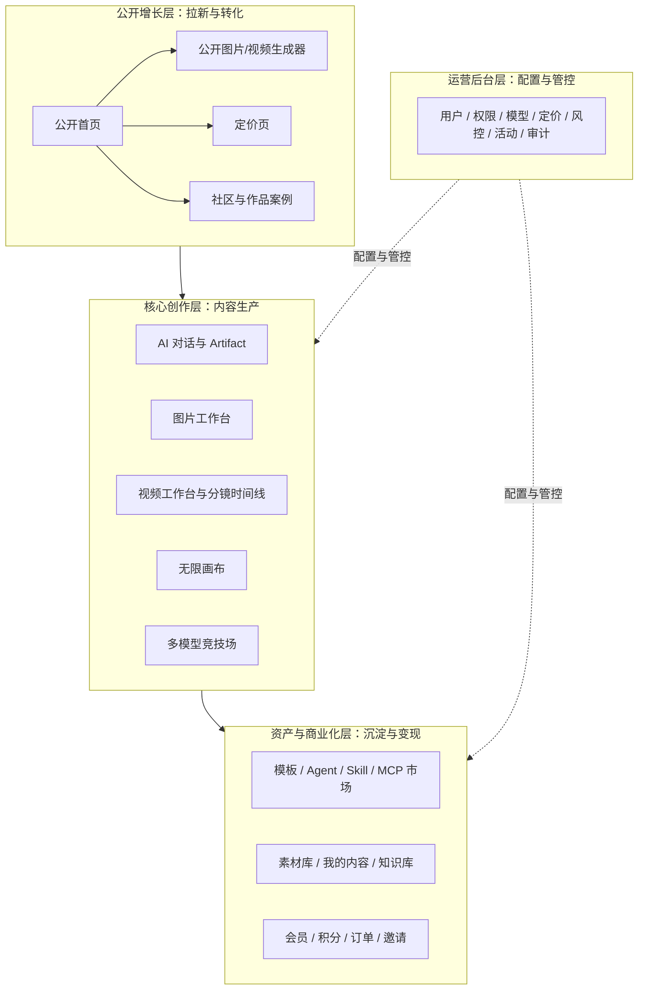
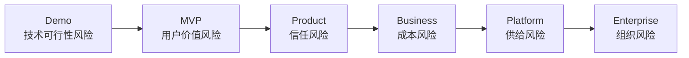
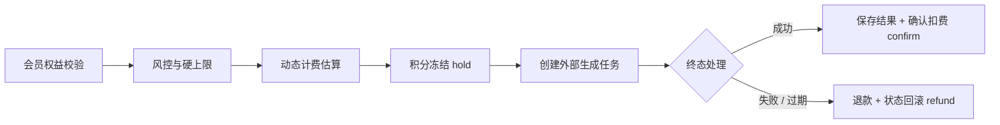
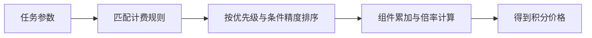
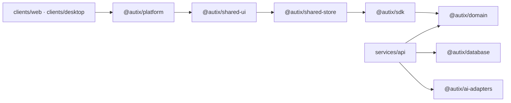

前二十章一直在讲 AI Agent 的工程化：模型接入、编排、检索、协议、评估、部署和交付。到了终章，需要把视角从“系统怎么搭”拉回到“产品怎么活下来”。Autix 在这里不再只是一个工程案例，而是这些工程约束进入产品阶段后的样子。

一个 AI 系统在 Demo 阶段只要证明“能做出来”就够了。可一旦进入真实产品，它面对的就不只是模型能力，还有用户预期、成本、支付、运营、供给和团队协作。很多看起来像“功能扩张”的设计，本质上是在处理风险：失败怎么兜底，成本怎么计算，结果怎么沉淀，策略怎么调整，团队怎么维护。

这一章就沿着这条线，回看 Autix 的产品形态、工程边界和商业约束，并提炼一套更通用的判断框架。

## 一、Autix 的产品形态

Autix 面向内容创作者、品牌和运营团队，覆盖 AI 对话、图片与视频生成、无限画布、多模型竞技场、资产市场、会员积分和运营后台。它不是一个单点工具，而是一条从获客到创作、从消费到沉淀、从配置到运营的完整链路。

从产品结构看，可以分成四层：

这四层分别承担不同任务：

*   公开增长层负责让用户理解产品，并完成第一次体验；
*   核心创作层承载真实创作流程；
*   资产与商业化层把一次生成转化为可复用资产和可计费行为；
*   运营后台层让模型、价格、权益、审核和风控不必依赖发版调整。

如果只看功能清单，Autix 很容易被归类为“AI 创作平台”。但从工程和商业闭环看，它更像是在做一件更难的事：把不稳定的模型能力，组织成一个可以持续交付的产品系统。后面的讨论，基本都围绕这个转化展开。

## 二、从 Demo 到产品：风险逐步收敛

Demo、MVP、Product、Business、Platform、Enterprise 不是简单的版本名。每进入一个阶段，系统要处理的核心风险都会变化。

可以把这个过程称为“风险收敛模型”：

> 产品的成熟，往往不是功能越堆越多，而是一类关键风险被识别、暴露，并最终被系统设计吸收。

这不是严格的流程图，而是一种判断产品阶段的方法。功能可以很多，但如果核心风险没有被收住，产品仍然停留在较早阶段。

| 阶段             | 主要风险    | 需要回答的问题                   | 典型收敛方式               |
| -------------- | ------- | ------------------------- | -------------------- |
| **Demo**       | 技术可行性风险 | 能力能不能做出来                  | 模型接入、基础编排、端到端链路      |
| **MVP**        | 用户价值风险  | 是否有人愿意反复使用                | 核心工作台、模板、素材沉淀、项目管理   |
| **Product**    | 信任风险    | 失败、延迟、质量波动之后，用户是否仍然信任系统   | 任务状态、失败退款、历史版本、结果保存  |
| **Business**   | 成本风险    | 收入能否覆盖模型成本、运营成本和增长成本      | 会员、积分、动态定价、风控策略      |
| **Platform**   | 供给风险    | 模板、Agent、Skill、MCP 能否持续增长 | 市场、审核、后台配置、创作者分成     |
| **Enterprise** | 组织风险    | 团队或企业能否把业务建立在系统之上         | 权限、审计、私有资产、稳定交付、边界治理 |

这个模型有三层含义。

第一，功能常常是风险被处理之后留下的形态。积分系统处理的是成本风险，任务状态机处理的是信任风险，运营后台处理的是策略调整和规模运营风险。如果只把它们看成“模块”，就会看不到真正的问题。

第二，阶段很难跳过。一个还没有验证用户价值的产品，提前做复杂商业化和后台系统，并不会自动进入 Business 阶段。它只是多了商业化模块，却不一定有稳定、可计费的需求。

第三，功能数量会干扰判断。产品变复杂，不代表产品更成熟。更可靠的判断标准，是当前阶段最关键的风险是否已经被系统消化。

## 三、AI 产品交付的是确定性

传统软件交付的是确定功能。用户点击按钮，系统执行一个明确动作。AI 产品交付的是不稳定能力。同样的输入，模型可能给出不同质量的输出；外部 Provider 可能排队、超时或失败；高质量生成也通常意味着更高成本。

所以，AI 产品的长期竞争力不只来自模型本身，还来自围绕模型建立的交付约束。这里的“确定性”至少包括五件事：

*   **结果可预期**：用户大致知道会得到什么，而不是完全碰运气；
*   **成本可计算**：一次生成会消耗多少积分，操作前就能估算；
*   **时间可感知**：任务处于排队、生成、完成、失败还是过期，状态清楚；
*   **失败可恢复**：失败之后可以重试、退款，或保留上下文继续处理；
*   **资产可延续**：生成结果、参考素材、模板和项目可以被继续使用。

Autix 的很多设计都围绕这组约束展开。图片工作台提供风格预设、参考图、历史版本和素材库；视频工作台提供项目、分镜、Clip、素材槽和时间线；积分系统负责成本预估、冻结、确认和退款；后台系统允许模型、价格、权益和风控策略持续调整。

这些机制合在一起，做的是同一件事：把模型输出的不确定性，限制在用户能理解、能接受、能恢复的范围内。

## 四、MVP 验证的是商业假设

MVP 的重点不在于功能少，而在于它能不能用最小系统验证最关键的假设。对 AI 创作产品来说，早期最该验证的通常不是“能不能接入更多模型”，而是：

*   用户是否愿意把真实创作流程放进统一工作台；
*   图片和视频是否能成为明确的高价值入口；
*   模板是否能降低使用门槛并提升转化；
*   积分是否能让模型成本变得容易理解；
*   失败退款和状态追踪是否能建立信任；
*   生成结果是否能沉淀为下一次创作的资产。

这些问题没有回答清楚之前，接入更多模型、增加更多参数、扩展更多页面，都不一定能让产品更接近商业化。相反，功能越早铺开，团队越难看清真正的问题。

这也是 Autix 后来必须补齐工程边界的原因。早期没有一次性做完整，并不是因为这些约束不重要，而是因为当时最重要的事还不是长期维护，而是验证能力能不能成立、用户愿不愿意用、哪条链路值得继续投入。那个阶段如果把所有边界都做重，反而会拖慢验证速度。

产品进入商业化之后，情况变了。用户开始为结果付费，模型调用形成真实成本，生成失败会带来退款和信任损失，后台策略也需要频繁调整。此时，类型契约、计费链路、任务状态、素材资产、模型配置、共享 UI 和后台配置就不再是“架构洁癖”，而是产品继续经营所需的基础约束。早期可以靠手工判断和局部修补的地方，到了商业阶段必须进入系统设计。

## 五、设计重心从页面转向能力约束

AI 产品的界面不能停留在输入框。一次真实创作往往包含一连串判断：选择风格、选择参考图、确定比例、决定是否高清、判断是否重试、判断是否保存、判断是否复用为模板、判断本次消耗是否值得。

输入框只能表达意图，承载不了这些判断。真正要设计的，是能力的边界、状态、成本和失败路径。

| 传统互联网产品 | AI 产品       |
| ------- | ----------- |
| 设计页面    | 设计能力约束      |
| 设计流程    | 设计失败路径      |
| 设计功能完成  | 设计结果概率和成本边界 |
| 系统负责执行  | 系统还要参与判断和恢复 |

### 5.1 图片工作台：降低四类不确定性

图片生成的难点不是参数不够多，而是用户在创作过程中会面对多种不确定性。

| 不确定性  | 用户表现              | 对应设计            |
| ----- | ----------------- | --------------- |
| 风格不确定 | 不知道如何描述想要的视觉效果    | 模板、风格预设、参考图     |
| 结果不确定 | 多次生成差异大，不知道哪次可用   | 历史版本、批量结果、收藏与保存 |
| 成本不确定 | 不知道高清、参考图、重试会消耗多少 | 积分预估、会员权益提示     |
| 沉淀不确定 | 好结果用完即丢           | 素材库、模板化、项目关联    |

这些设计并没有改变模型本身，却改变了用户使用模型的方式。用户不再只是等待一次生成结果，而是在一个可保存、可比较、可复用的工作空间里推进创作。

### 5.2 视频工作台：把高成本生成拆成可管理对象

视频生成比图片生成更复杂，成本更高，失败影响也更大。因此，视频工作台不能只围绕 Prompt 设计。

在 Autix 中，一次视频创作被拆成多个对象：项目承载完整目标，分镜描述结构，Clip 支持逐段生成、重试和替换，素材槽管理首帧、尾帧、参考图和参考音频，时间线呈现整体顺序，任务状态区分排队、生成、完成、失败与过期，积分预算标明每一步操作的成本。

这些对象的作用，是把一次高风险生成拆成多个可观察、可恢复、可替换的局部操作。失败不再意味着整次创作失控，而是落在某个任务、某个分镜或某个 Clip 上。用户能看到问题发生在哪里，也能决定下一步是重试、替换还是继续编辑。

### 5.3 无限画布：让创意关系显性化

无限画布处理的是创作过程中的关系组织。参考图连接到视频节点，可以表示图生视频；两张图连接到同一节点，可以表示首尾帧；多个分镜节点连成序列，可以表示 storyboard。

画布上的拖拽和连线看起来是交互设计，背后其实是素材解析、参数推断、积分冻结、外部生成、状态回写和结果沉淀。用户表达的是创意关系，系统执行的是完整生成链路。

## 六、创作与计费进入同一条链路

图片、视频和工作流生成都不是简单请求。一次任务通常包含八个步骤：

1.  判断用户是否有权限；
2.  检查会员权益；
3.  估算本次生成成本；
4.  冻结积分；
5.  调用外部模型；
6.  等待异步结果；
7.  成功后确认扣费，失败后退款；
8.  保存结果并通知前端。

如果创作和计费分散在不同链路里，状态很容易不一致：扣了费但生成失败，任务成功但积分没扣，回调重复导致重复扣费，超时任务长期占用余额。这里的核心问题不是“服务拆得够不够细”，而是一次生成任务的业务不变量能不能被可靠维护。

早期没有把 Identity、Billing、Creation 拆成独立微服务，是因为当时最大的矛盾还不是系统规模，而是产品闭环能不能跑通。图片能不能生成、视频能不能返回、用户愿不愿意保存素材、积分是否容易理解，这些问题没有验证之前，服务拆分带来的治理成本很难产生收益。

到了现在，创作、计费和权益已经不再是几个页面背后的辅助逻辑，而是产品交易链路本身。一次生成失败，不只是技术异常，还会影响积分、退款、用户信任和后续留存。这个阶段如果继续把状态处理散落在各处，问题就会从“代码不够优雅”变成“账务与结果不一致”。

因此，Autix 采用的不是“越早微服务越好”的路线，而是先把 Identity、Billing、Creation 聚合在同一个 NestJS 后端进程内。这个选择背后的判断很直接：交易链路还在快速变化时，最重要的是一致性、排障效率和演进速度，而不是服务自治。

如果过早拆成多个服务，创作任务、积分冻结、外部回调、退款补偿都会跨越多个进程和数据库边界。系统还要额外引入消息队列、分布式事务、补偿任务、链路追踪和跨服务重试策略。它们当然可以解决问题，但也会把团队的注意力从产品验证拉到基础设施治理上。对于一个仍在快速调整价格、模型、权益和任务形态的产品，这种复杂度来得太早。

所以这里采用的是更务实的边界划分：**部署上先保持单体，领域上提前分层**。Identity、Billing、Creation 在运行时仍处于同一事务边界内，但代码结构已经按领域隔离。这样既能保证关键链路的一致性，也为后续拆分留下边界。等到某个领域的吞吐、团队规模或部署节奏真正独立，再拆服务才有明确收益。

后端按六个领域组织：

| 领域              | 承担内容                        | 主要处理的问题  |
| --------------- | --------------------------- | -------- |
| **Identity**    | 登录、用户、角色、权限、会话、风控           | 权限与滥用    |
| **Billing**     | 会员、积分、订单、活动、邀请              | 成本、收入与增长 |
| **Creation**    | 对话、LLM、Artifact、图片、视频、素材、画布 | 内容生产     |
| **Marketplace** | Agent、Skill、MCP、图片与视频模板     | 供给增长     |
| **Admin**       | 后台管理、批量任务、迁移、审计             | 运营配置     |
| **Platform**    | Prisma、SSE、存储、邮件、系统设置、i18n  | 横切基础设施   |

高风险异步任务统一走 hold / confirm / refund 流程：

不同任务使用不同扣费模式：

| 模式               | 使用场景                       | 原因                     |
| ---------------- | -------------------------- | ---------------------- |
| **直接扣费**         | 获取市场资源，如模板、Agent、Skill、MCP | 结果立即生效，适合同事务扣除         |
| **冻结 → 确认 / 退款** | 图片、视频等异步生成                 | 任务可能失败，需要先锁定预算，终态后结算   |
| **实时追踪扣费**       | 长工作流、LLM 多轮调用              | 成本随 token 和步骤变化，需要动态记录 |

幂等性依赖几条硬约束：同一 taskId 已有活跃 hold 时直接复用；confirm 和 refund 只能从允许的状态迁移；超时未完成的 hold 由定时任务回收退款。这样一来，Provider 回调、定时轮询和用户刷新即使多次触发，也会进入同一个终态处理逻辑。

对用户来说，这条链路的意义很直接：成功就得到结果并扣费，失败就退回积分。信任感不是靠文案建立的，而是靠状态和账务一致性建立的。

## 七、动态定价：把模型成本纳入产品系统

AI 内容平台的边际成本不能被忽略。图片、视频、多轮工作流和高端模型调用，都对应真实成本。商业化设计如果不处理这件事，产品越活跃，亏损可能越大。

Autix 将计费规则放在数据库中，而不是写死在代码里。一次生成的价格由多个因素共同决定：

*   任务类型：对话、图片、视频、Prompt 优化、模板调用；
*   图片质量、比例、分辨率、参考图数量；
*   视频分辨率、时长、是否带音频；
*   模型档位、会员等级、活动或运营策略。

这样做的价值在于，模型成本、用户权益和运营策略可以在同一个系统里调整。高分辨率、高时长、高并发不会被无限开放；高成本任务先冻结预算；失败退款和滥用风控可以同时存在；价格、补贴和活动也不必每次都重新发版。

成本控制不是简单限制用户，而是给每一种能力建立清晰的使用边界。

## 八、市场：把能力沉淀为资产

单次生成的内容是一次性结果。更有长期价值的，是结果背后的经验：Prompt、风格、分镜、模板、Skill、Agent 和工作流。

Autix 的市场不是普通模板列表，而是把不同层级的能力封装为可获取、可交易、可复用的资产。

| 资产类型          | 代表内容              | 作用                 |
| ------------- | ----------------- | ------------------ |
| **图片 / 视频模板** | 海报、商品图、分镜脚本、首尾帧结构 | 降低门槛，覆盖高频场景，拉动积分消费 |
| **Agent**     | 带系统提示词、工具和工作流的智能体 | 封装可执行的多步骤方法        |
| **Skill**     | 可复用的专业方法和操作规范     | 沉淀领域经验             |
| **MCP**       | 外部工具、数据源、自动化能力    | 连接真实系统，扩展能力边界      |

一个 Agent 不只是一句 Prompt。它至少包含系统提示词、默认模型、工具绑定、Skill 绑定、MCP 能力、执行模式，以及可选的多步骤 workflow。进入 workflow 模式后，任务可以被拆成多个步骤，每一步都有自己的输入、产物类型、校验和评审逻辑。

在这个结构里，Skill 负责沉淀方法，MCP 负责连接工具，Agent 负责把方法和工具组织成可执行过程。平台长期积累的不是某一次生成结果，而是这些可以被反复调用的经验资产。

## 九、工程边界：让系统能被长期维护

工程架构的价值不在于形式上的“分层”或“规范”，而在于它能不能降低未来变化的成本。Autix 早期不需要把这些边界全部做重，是因为那时的变化主要来自探索：页面会改，入口会改，模型会换，甚至核心场景也可能调整。过早固定架构，会让试错成本变高。

现在必须补上边界，是因为变化的性质已经不同。早期变化是“方向还没确定”，现在变化是“方向确定后持续扩展”：Web 与桌面端并存，前台创作与后台运营并存，模型能力频繁变化，计费和权益持续调整，模板、Agent、Skill、MCP 逐渐形成市场供给。前一种变化需要速度，后一种变化需要边界。没有边界，持续扩展会把每次修改都变成全局风险。

当产品还在一个人或一个小团队手里时，很多约束可以依赖习惯和记忆。系统进入更长周期后，维护者会变化，模块会增加，策略会调整，依赖关系会变复杂。此时，架构不能只依赖“大家自觉”，必须把约束写进工程系统。

Autix 选择 Bun workspaces + Turbo 组织 monorepo，并不是为了追求仓库形式上的统一，而是为了同时满足三类诉求：

*   **共享**：Web、桌面端和后台需要复用同一套类型、SDK、状态管理和业务 UI；
*   **隔离**：前端不应直接知道数据库结构，UI 不应直接依赖运行时环境，领域规则不应被页面逻辑污染；
*   **演进**：模型适配、计费规则、素材资产、市场供给和跨端能力都会持续变化，架构需要允许局部变化，而不是每次修改都牵动全局。

所以，monorepo 在这里不是把所有代码简单放在一起，而是明确表达三件事：哪些东西应该共享，哪些东西必须隔离，哪些东西可以独立演进。

Autix 使用 Bun workspaces + Turbo 将高频变化、跨端复用和长期稳定的部分分开：

    clients/*      平台入口
      web          Next.js：公开页、业务路由、SEO、BFF 代理
      desktop      Electron：窗口、托盘、自动更新、本地能力、IPC

    services/*     后端服务
      api          NestJS + Prisma + LangChain：统一后端，六大领域聚合

    packages/*     共享内核
      domain        类型、枚举、纯业务规则
      sdk           HTTP / SSE 客户端
      platform      Web / Desktop 运行时适配
      shared-store  Zustand + React Query + actions
      shared-ui     跨端业务 UI
      database      Prisma schema、迁移、seed
      ai-adapters   AI Provider 适配层
      i18n          多语言消息

这套分层背后的判断是：越靠下的包越接近稳定契约，越靠上的应用越接近具体场景。`domain`、`sdk`、`database`、`ai-adapters` 这类包承担长期契约；`web`、`desktop`、后台页面承担变化最快的交互和运营需求。稳定层不应该反向依赖变化层，否则底层契约会被页面需求不断拉扯，最终失去复用价值。

依赖方向只允许自上而下流动：

几条规则需要被持续执行：

*   UI 不直接请求接口；
*   clients 不直接依赖后端源码；
*   shared-ui 不直接读取 localStorage 或 Electron；
*   domain 不依赖任何上层包；
*   数据访问必须经过 service / repository。

这些规则分别对应具体的工程问题。UI 如果直接请求接口，加载状态、错误处理、权限判断和缓存策略会散落到组件里；clients 如果直接依赖后端源码，前后端边界会变成编译时耦合；shared-ui 如果读取 localStorage 或 Electron，就无法在 Web、桌面端和后台之间稳定复用；domain 如果依赖上层包，领域规则会被框架和页面污染；Controller 如果直接注入 Prisma，业务逻辑会绕过 service / repository，后续审计、事务和权限控制都会变得困难。

这些规则被写进 `scripts/check-architecture-boundaries.ts`，通过 `arch:check` 在提交时检查。前端直接依赖数据库、shared-ui 出现 fetch / localStorage、Controller 直接注入 Prisma 等行为，都会被拦住。

架构边界不应该只留在文档里。文档能说明意图，但不能阻止回归；Code Review 能发现问题，但依赖人的注意力；CI 检查则把架构约束变成每次提交都要通过的客观条件。对于一个会持续增加模型、页面、模板、Agent 和运营规则的系统，这比一次性的架构设计更重要。

## 十、跨端一致性：平台适配层

Autix 同时提供 Web 和桌面端。桌面端不是重写一套产品，而是在共享业务层之上增加本地能力：系统托盘、自动更新、Deep Link、全局快捷键、OAuth loopback、本地安全存储 token、本地安装 Skill / MCP / Agent。

Web 与桌面端的运行时差异被收进 `@autix/platform`。上层业务组件只调用统一接口，不判断自己运行在浏览器还是 Electron。新功能默认写在 shared-ui 和 shared-store 中，两端自然复用。

这样做的目的不只是提高“代码复用率”。如果每个业务组件都自行判断运行环境，短期实现可能很快，长期会留下大量隐式分支：同一个登录状态在 Web 和桌面端有两套处理，同一个素材保存动作有两套路径，同一个 Agent 安装流程在不同端表现不一致。问题不会马上爆发，但会随着功能增加逐渐变成难以维护的差异。

平台适配层把这种差异提前收口。Web 负责浏览器能力，桌面端负责本地能力，业务层只面对统一接口。用户在 Web 上建立的项目、素材、模板和 Agent，应该能够在桌面端延续；桌面端获得的本地能力，也不应该破坏共享业务逻辑。跨端一致性只有进入架构层，才不会在每次迭代里被重新讨论。

## 十一、从工程系统到可经营产品

回到开头的问题：AI 系统怎样从 Demo 变成一门可以持续经营的生意？

答案不是一开始就把所有系统做重。Demo 阶段要尽快证明能力存在，MVP 阶段要尽快验证用户是否愿意回来。那时最该避免的，是把尚未验证的需求过早固化进复杂架构。早期不做积分冻结、动态定价、后台配置、严格边界检查和完整市场体系，并不是因为它们不重要，而是因为只有当交易、成本、供给和维护问题真实出现后，它们才有明确的设计依据。

真正的变化发生在产品进入商业化之后。用户开始付费，失败开始对应退款，模型成本开始影响毛利，后台策略开始影响转化，模板和 Agent 开始形成供给，Web 与桌面端开始共享同一批资产。此时，原来可以靠人工处理的问题，会变成系统必须承担的责任。工程架构的重点也随之变化：从“把能力跑通”，转向“让能力稳定地被交付、计费、运营和延续”。

因此，Autix 后来的工程选择不是对早期实现的否定，而是产品阶段变化后的自然结果：

*   模型接入解决能力是否存在；
*   工作台解决用户是否能持续使用；
*   素材和模板解决结果是否能沉淀；
*   任务状态和退款机制解决失败后是否还能被信任；
*   积分和动态定价解决成本是否可控；
*   市场解决供给是否能增长；
*   后台配置解决运营是否能脱离发版；
*   架构边界解决团队是否还能长期维护。

这些约束共同说明一件事：AI 产品的成熟，不是功能越做越多，而是把原本靠人判断、靠人工补救、靠临时经验处理的问题，逐步交给系统承担。系统承担得越多，用户感受到的不确定性就越少；不确定性越少，产品才越接近可经营状态。

这也是 AI 产品与传统互联网产品的重要差异。传统软件主要交付确定功能，工程重点是把流程实现正确；AI 产品交付的是不确定能力，工程重点是为这种不确定性建立边界。模型可以生成结果，但产品必须处理结果之外的所有状态：等待、失败、重试、退款、保存、复用、审核、计费和运营。真正影响用户是否继续使用的，往往不是一次最好的生成，而是一次失败之后系统怎么处理。

如果前二十章讨论的是如何构建一个 AI 系统，那么终章讨论的是这个系统如何获得产品形态和商业形态。一个 AI 系统可以依靠模型能力完成 Demo，但一门可持续经营的生意，必须依靠工程约束完成交付。最终要回答的问题，也不再是“还能接入什么模型”，而是“用户能不能放心把工作交给这个系统”。

> **将能力接入主链路，将风险约束在边界之内，将成本纳入预算，将失败设计为可恢复，将结果沉淀为资产。只有当这些约束进入系统，AI 能力才不只是一次演示，而会成为可以被持续使用、持续计费、持续运营的产品。**

> 后续我会根据项目进度，逐步补充更新内容作为附加章节。敬请持续关注本系列文章的更新，一起看看它能否最终记录到一个产品的诞生。

## 写在最后

> 这里是**言萧凡的 AI 编程实验室**。本系列持续记录 AI 工具、编程实践与可复用的工程方法，尽量同时覆盖概念、代码和验证路径，帮助读者在真实项目中完成探索、实践与沉淀。

**欢迎通过微信号【Cookieboty】交流。**